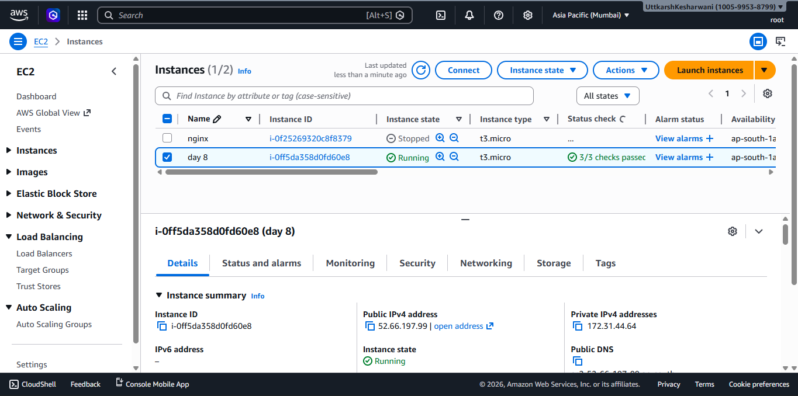
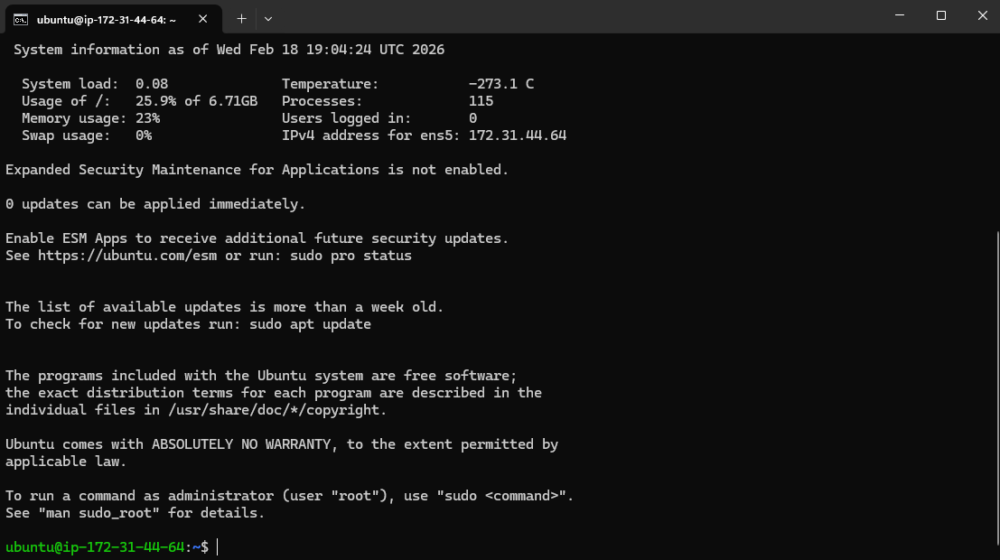
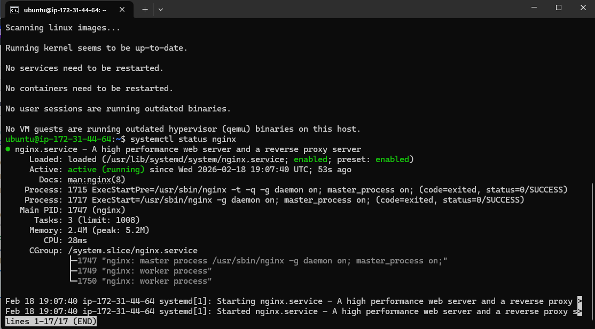
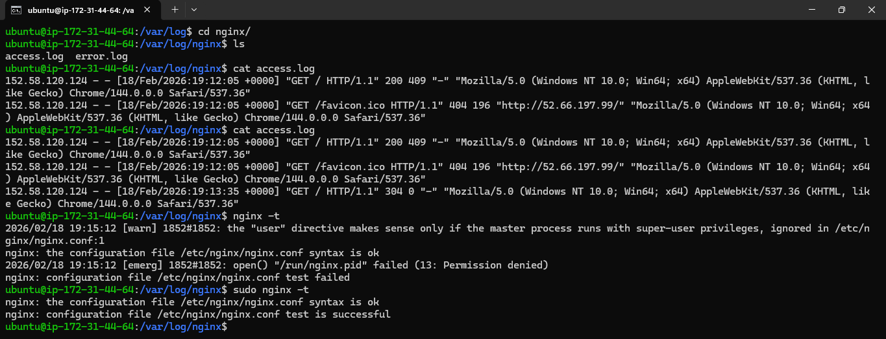
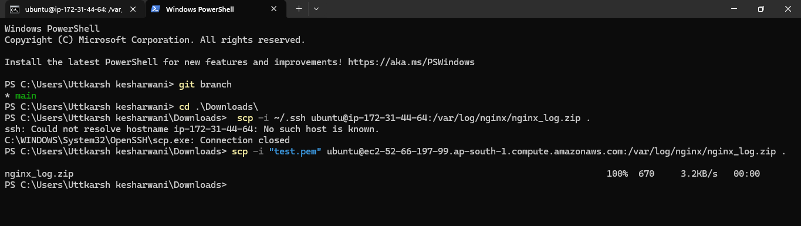

### Part 1: Launch Cloud Instance & SSH Access 

**Step 1: Create a Cloud Instance**

**Step 2: Connect via SSH**

### Part 2: Install Docker & Nginx 

**Step 1: Update System**
`apt update`

**Step 2: Install Nginx**
`sudo apt install nginx -y`

**Verify Nginx is running:**
`sudo systemctl status nginx | grep active`

### Part 3: Security Group Configuration 

### Part 4: Extract Nginx Logs (15 minutes)

**Step 1: View Nginx Logs**

**Step 2: Save Logs to File**
`scp -r /var/log/`

**Step 3: Download Log File to Your Local Machine**

