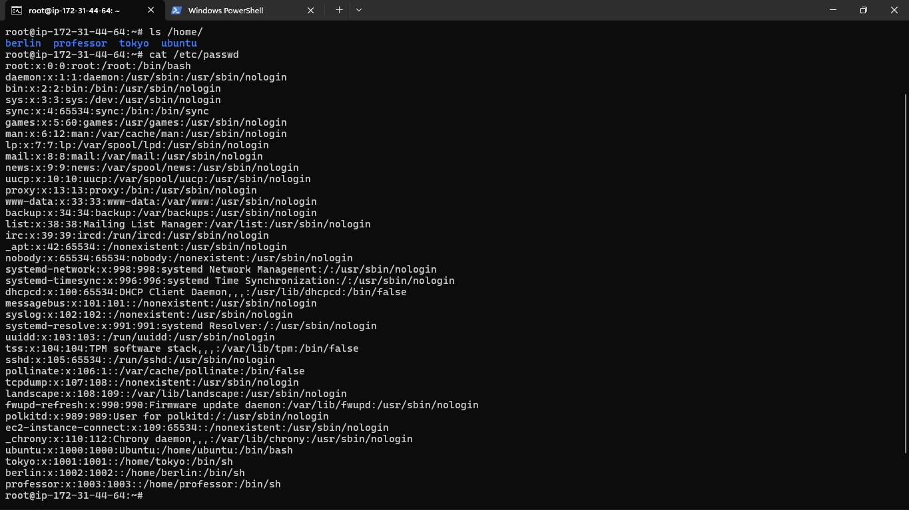
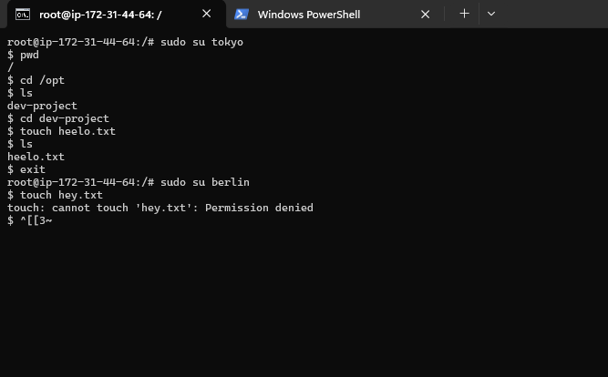
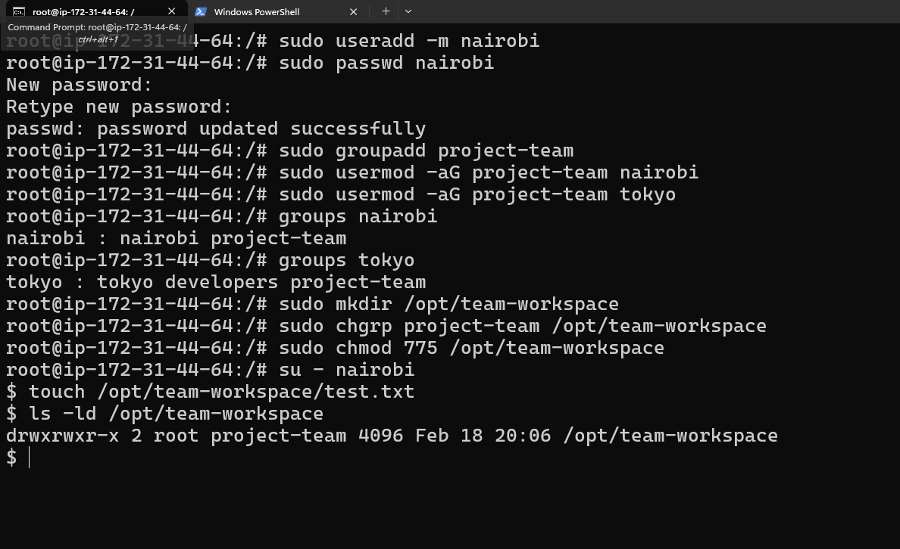

### Task 1: Create Users (20 minutes)

  `useradd -m <username>`

  `cat /etc/passwd` : show all the user and their detials with shell permisiion
 
 

### Task 2: Create Groups (10 minutes)

  `groupadd <group_name>`
  
  `/etc/group` :- place where the details of group is present 

### Task 3: Assign to Groups 

  `sudo usermod -a -G groupName userName`

  

### Task 4: Shared Directory (20 minutes)

Extra learning :- 
- Check groups of perticular user : `groups username`

### Task 5: Team Workspace (20 minutes)

