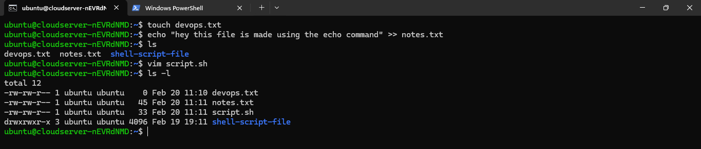
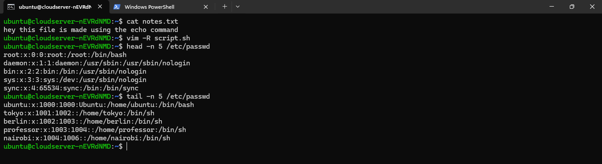
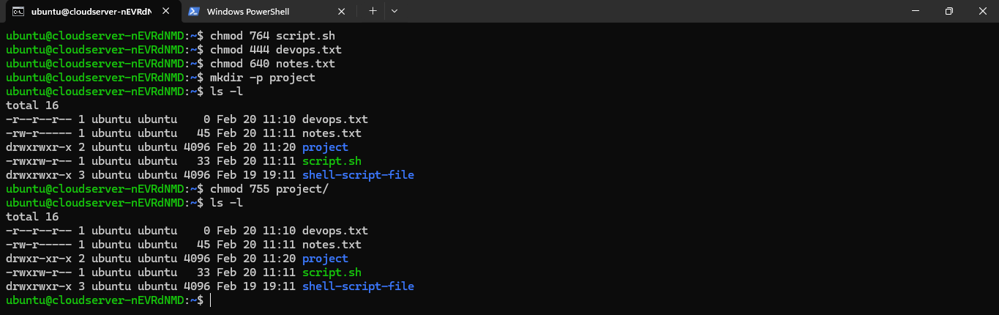

### Task 1: Create Files 

1. Create empty file `devops.txt` using `touch`
2. Create `notes.txt` with some content using `cat` or `echo`
3. Create `script.sh` using `vim` with content: `echo "Hello DevOps"`

**Verify:** `ls -l` to see permissions



### Task 2: Read Files 

1. Read `notes.txt` using `cat`
2. View `script.sh` in vim read-only mode
3. Display first 5 lines of `/etc/passwd` using `head`
4. Display last 5 lines of `/etc/passwd` using `tail`




### Task 3: Understand Permissions 

Format: `rwxrwxrwx` (owner-group-others)
- `r` = read (4), `w` = write (2), `x` = execute (1)

Check your files: `ls -l devops.txt notes.txt script.sh`

Answer: What are current permissions? Who can read/write/execute?

  ``` text 
    ubuntu@cloudserver-nEVRdNMD:~$ ls -l devops.txt notes.txt script.sh
    -rw-rw-r-- 1 ubuntu ubuntu  0 Feb 20 11:10 devops.txt
    -rw-rw-r-- 1 ubuntu ubuntu 45 Feb 20 11:11 notes.txt
    -rw-rw-r-- 1 ubuntu ubuntu 33 Feb 20 11:11 script.sh
  ```
  owner(ubuntu) :- can read/write
  group(ubuntu) :- can read/write
  other user :- can read only


### Task 4: Modify Permissions  

1. Make `script.sh` executable → run it with `./script.sh`
2. Set `devops.txt` to read-only (remove write for all)
3. Set `notes.txt` to `640` (owner: rw, group: r, others: none)
4. Create directory `project/` with permissions `755`

**Verify:** `ls -l` after each change



### Task 5: Test Permissions 

1. Try writing to a read-only file - what happens?
  => will see error :- bash: test.txt: Permission denied

2. Try executing a file without execute permission
  => will see error :- bash: ./script.sh: Permission denied

3. Document the error messages

  Error : Permission denied
