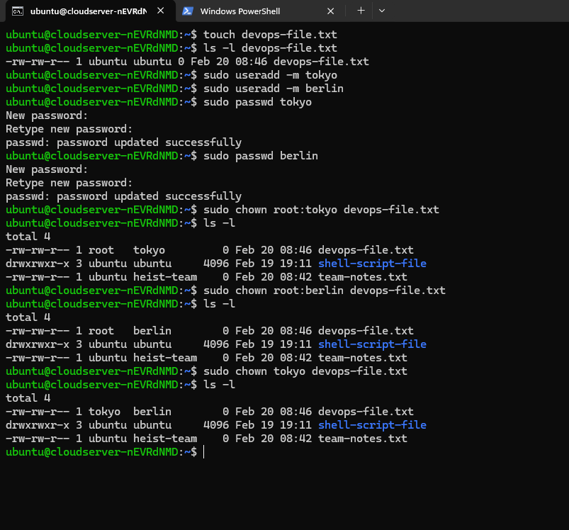
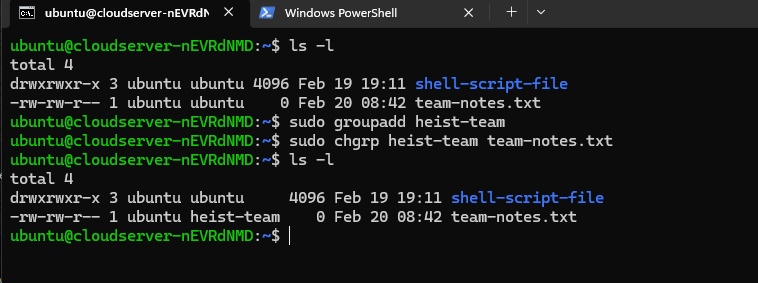
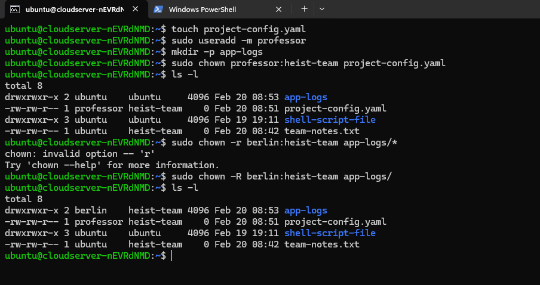
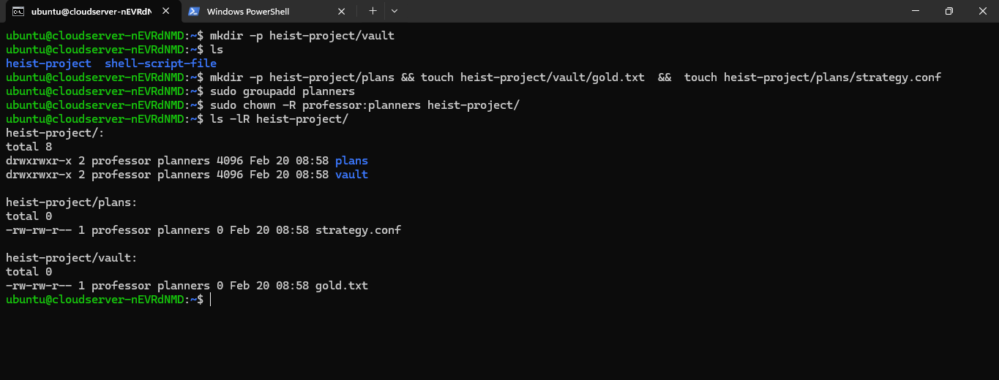
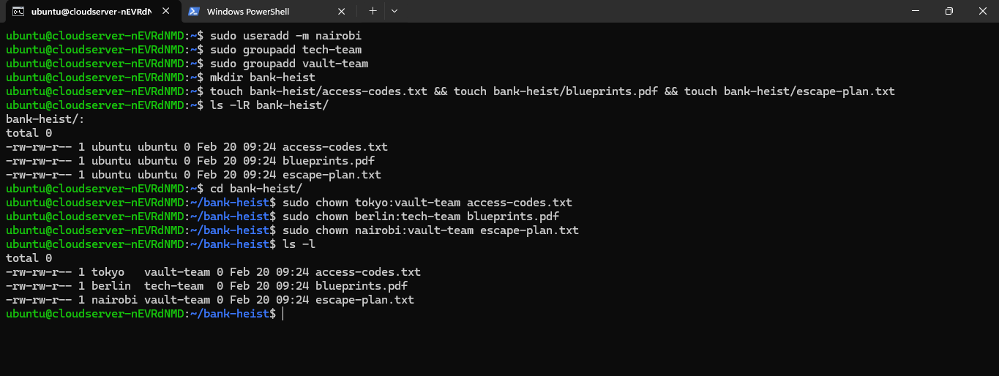

### Task 1: Understanding Ownership 

1. Run `ls -l` in your home directory :- it list down the files and directory in the long list format like (owner , permission ,date , size etc ).

  ``` txt 
    ubuntu@cloudserver-nEVRdNMD:~$ ls -l
    total 12
    -rw-rw-r-- 1 ubuntu ubuntu   21 Feb 17 18:25 notes.txt
    drwxrwxr-x 3 ubuntu ubuntu 4096 Feb 17 12:54 practicle
    drwxrwxr-x 3 ubuntu ubuntu 4096 Feb 19 19:11 shell-script-file
  ```

2. Identify the **owner** and **group** columns

  Here owner and group are :- ubuntu and ubuntu respectively

3. Check who owns your files :- owner is ubuntu

Document: What's the difference between owner and group?
  - owner :- who creates the file 
  - group :- group of people who is present in the groups ,and they get permission to execute based on the permission 

### Task 2: Basic chown Operations 

1. Create file `devops-file.txt`
2. Check current owner: `ls -l devops-file.txt`
3. Change owner to `tokyo` (create user if needed)
4. Change owner to `berlin`
5. Verify the changes




### Task 3: Basic chgrp Operations (15 minutes)

1. Create file `team-notes.txt`
2. Check current group: `ls -l team-notes.txt`
3. Create group: `sudo groupadd heist-team`
4. Change file group to `heist-team`
5. Verify the change




### Task 4: Combined Owner & Group Change (15 minutes)

Using `chown` you can change both owner and group together:

1. Create file `project-config.yaml`
2. Change owner to `professor` AND group to `heist-team` (one command)
3. Create directory `app-logs/`
4. Change its owner to `berlin` and group to `heist-team`




### Task 5: Recursive Ownership

1. Create directory structure:
   ```
   mkdir -p heist-project/vault
   mkdir -p heist-project/plans
   touch heist-project/vault/gold.txt
   touch heist-project/plans/strategy.conf
   ```

2. Create group `planners`: `sudo groupadd planners`

3. Change ownership of entire `heist-project/` directory:
   - Owner: `professor`
   - Group: `planners`
   - Use recursive flag (`-R`)

4. Verify all files and subdirectories changed: `ls -lR heist-project/`




### Task 6: Practice Challenge 

1. Create users: `tokyo`, `berlin`, `nairobi` (if not already created)
2. Create groups: `vault-team`, `tech-team`
3. Create directory: `bank-heist/`
4. Create 3 files inside:
   ```
   touch bank-heist/access-codes.txt
   touch bank-heist/blueprints.pdf
   touch bank-heist/escape-plan.txt
   ```

5. Set different ownership:
   - `access-codes.txt` → owner: `tokyo`, group: `vault-team`
   - `blueprints.pdf` → owner: `berlin`, group: `tech-team`
   - `escape-plan.txt` → owner: `nairobi`, group: `vault-team`

**Verify:** `ls -l bank-heist/`




