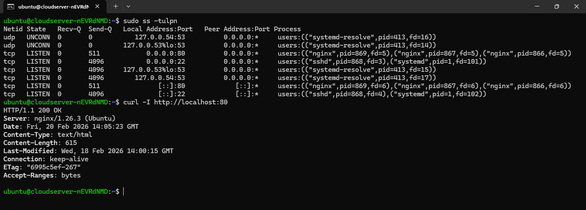

Layer-by-Layer:

L7 – Application
- Where user-facing protocols work (HTTP, FTP, SMTP, DNS).
- Provides network services to applications.

L6 – Presentation
- Data formatting, encryption, compression.
- Example: SSL/TLS encryption happens here logically.

L5 – Session
- Manages sessions between systems.
- Maintains and terminates communication sessions.

L4 – Transport
- End-to-end communication.
- Handles ports, reliability, sequencing.
- Protocols: TCP, UDP

L3 – Network
- Logical addressing and routing.
- Protocol: IP
- Routers operate here.

L2 – Data Link
- MAC addressing, frames.
- Switches operate here.
- Ethernet, ARP.

L1 – Physical
- Actual transmission of bits.
- Cables, fiber, WiFi signals.


Application Layer
- Combines OSI L5–L7.
- Protocols: HTTP, HTTPS, DNS, FTP, SMTP.

Transport Layer
- Same as OSI L4.
- Protocols: TCP, UDP.

Internet Layer
- Same as OSI L3.
- Protocol: IP.
- Handles routing and logical addressing.

Link Layer
- Combines OSI L1 + L2.
- Ethernet, ARP, MAC addressing.


## Hands-on Checklist (run these; add 1–2 line observations)

- **Identity:** 

  `hostname -I` :- It displays the IP address associated with your hostname(private IP).
  `ip addr show` :- This command displays all network interfaces and their IP addresses on your system. It gives the detail info.

- **Reachability:** 

  `ping <target>` :- ping is used to check network connectivity between your system and another host (server, website, IP).

- **Path:**

  `traceroute <target>` (or `tracepath`) :- Shows the path (hops) your packet takes to reach a destination. It tells you: How many routers it passes through, Where delay is happening, Where connection is breaking

- **Ports:** 

  `ss -tulpn` (or `netstat -tulpn`) :- Used to check network connect and listening port of service running on the macing . `ss` is the moder over `netstat`

- **Name resolution:**

    `dig <domain>` or `nslookup <domain>` :- nslookup is used to query DNS and resolve domain names into IP addresses.

- **HTTP check:**

  `curl -I <http/https-url>` :- Used to test the API endpoints

- **Connections snapshot:**

  `netstat -an | head` :-   Displays network connections.

``` text 

    ubuntu@cloudserver-nEVRdNMD:~$ hostname -I
    103.209.147.15
    ubuntu@cloudserver-nEVRdNMD:~$ ip add
    1: lo: <LOOPBACK,UP,LOWER_UP> mtu 65536 qdisc noqueue state UNKNOWN group default qlen 1000
        link/loopback 00:00:00:00:00:00 brd 00:00:00:00:00:00
        inet 127.0.0.1/8 scope host lo
          valid_lft forever preferred_lft forever
        inet6 ::1/128 scope host noprefixroute
          valid_lft forever preferred_lft forever
    2: eth0: <BROADCAST,MULTICAST,UP,LOWER_UP> mtu 1500 qdisc mq state UP group default qlen 1000
        link/ether 00:16:3e:b5:10:af brd ff:ff:ff:ff:ff:ff
        altname enp0s3
        altname enx00163eb510af
        inet 103.209.147.15/22 brd 103.209.147.255 scope global eth0
          valid_lft forever preferred_lft forever
        inet6 fe80::216:3eff:feb5:10af/64 scope link proto kernel_ll
          valid_lft forever preferred_lft forever
    ubuntu@cloudserver-nEVRdNMD:~$ ping google.com
    PING google.com (142.251.43.238) 56(84) bytes of data.
    64 bytes from bkk02s04-in-f14.1e100.net (142.251.43.238): icmp_seq=1 ttl=116 time=38.6 ms
    64 bytes from bkk02s04-in-f14.1e100.net (142.251.43.238): icmp_seq=2 ttl=116 time=38.5 ms
    64 bytes from bkk02s04-in-f14.1e100.net (142.251.43.238): icmp_seq=3 ttl=116 time=38.5 ms
    ^X64 bytes from bkk02s04-in-f14.1e100.net (142.251.43.238): icmp_seq=4 ttl=116 time=38.5 ms
    ^Z
    [1]+  Stopped                 ping google.com
    ubuntu@cloudserver-nEVRdNMD:~$ traceroute google.com
    traceroute: command not found
    ubuntu@cloudserver-nEVRdNMD:~$ traceroute google.com
    traceroute: command not found
    ubuntu@cloudserver-nEVRdNMD:~$ tracepaht google.com
    Command 'tracepaht' not found, did you mean:
      command 'tracepath' from deb iputils-tracepath (3:20240905-1ubuntu1.1)
    Try: sudo apt install <deb name>
    ubuntu@cloudserver-nEVRdNMD:~$ tracepa0ht google.com
    tracepa0ht: command not found
    ubuntu@cloudserver-nEVRdNMD:~$ tracepath google.com
    1?: [LOCALHOST]                      pmtu 1500
    1:  1-147-209-103.microhost.com                           0.668ms
    1:  1-147-209-103.microhost.com                           0.694ms
    2:  ???                                                   0.596ms
    3:  ???                                                   0.739ms
    4:  ???                                                   0.627ms asymm  3
    5:  203.199.58.221                                        1.501ms
    6:  no reply
    7:  14.141.123.226.static-Chennai.vsnl.net.in            32.200ms asymm  5
    8:  no reply
    9:  115.112.15.74.static-chennai.vsnl.net.in             37.025ms asymm 10
    10:  no reply
    11:  no reply
    12:  no reply
    13:  no reply
    ^C
    ubuntu@cloudserver-nEVRdNMD:~$ ss -tulpn
    Netid         State          Recv-Q         Send-Q                   Local Address:Port                   Peer Address:Port         Process
    udp           UNCONN         0              0                           127.0.0.54:53                          0.0.0.0:*
    udp           UNCONN         0              0                        127.0.0.53%lo:53                          0.0.0.0:*
    tcp           LISTEN         0              511                            0.0.0.0:80                          0.0.0.0:*
    tcp           LISTEN         0              4096                           0.0.0.0:22                          0.0.0.0:*
    tcp           LISTEN         0              4096                     127.0.0.53%lo:53                          0.0.0.0:*
    tcp           LISTEN         0              4096                        127.0.0.54:53                          0.0.0.0:*
    tcp           LISTEN         0              511                               [::]:80                             [::]:*
    tcp           LISTEN         0              4096                              [::]:22                             [::]:*
    ubuntu@cloudserver-nEVRdNMD:~$ nslookup google.com
    Server:         127.0.0.53
    Address:        127.0.0.53#53

    Non-authoritative answer:
    Name:   google.com
    Address: 142.250.183.238
    Name:   google.com
    Address: 2404:6800:4002:819::200e

    ubuntu@cloudserver-nEVRdNMD:~$ curl -I http://localhost:80
    HTTP/1.1 200 OK
    Server: nginx/1.26.3 (Ubuntu)
    Date: Fri, 20 Feb 2026 13:38:40 GMT
    Content-Type: text/html
    Content-Length: 615
    Last-Modified: Wed, 18 Feb 2026 14:00:15 GMT
    Connection: keep-alive
    ETag: "6995c5ef-267"
    Accept-Ranges: bytes

    ubuntu@cloudserver-nEVRdNMD:~$ netstat -an | head
    Command 'netstat' not found, but can be installed with:
    sudo apt install net-tools
    ubuntu@cloudserver-nEVRdNMD:~$ ss -an | head
    Netid State     Recv-Q Send-Q                                          Local Address:Port           Peer Address:Port
    nl    UNCONN    0      0                                                           0:1                          *
    nl    UNCONN    0      0                                                           0:0                          *
    nl    UNCONN    0      0                                                           0:413                        *
    nl    UNCONN    0      0                                                           0:413                        *
    nl    UNCONN    0      0                                                           0:1                          *
    nl    UNCONN    960    0                                                           4:0                          *
    nl    UNCONN    4352   0                                                           4:1991                       *
    nl    UNCONN    0      0                                                           7:0                          *
    nl    UNCONN    0      0                                                           9:1                          *
    ubuntu@cloudserver-nEVRdNMD:~$

```


## Mini Task: Port Probe & Interpret

1) Identify one listening port from `ss -tulpn` (e.g., SSH on 22 or a local web app).  
2) From the same machine, test it: `nc -zv localhost <port>` (or `curl -I http://localhost:<port>`).  
3) Write one line: is it reachable? If not, what’s the next check? (e.g., service status, firewall).



## Reflection (add to your markdown)

- Which command gives you the fastest signal when something is broken?
  => ping command

- What layer (OSI/TCP-IP) would you inspect next if DNS fails? If HTTP 500 shows up?
  => Application Layer

