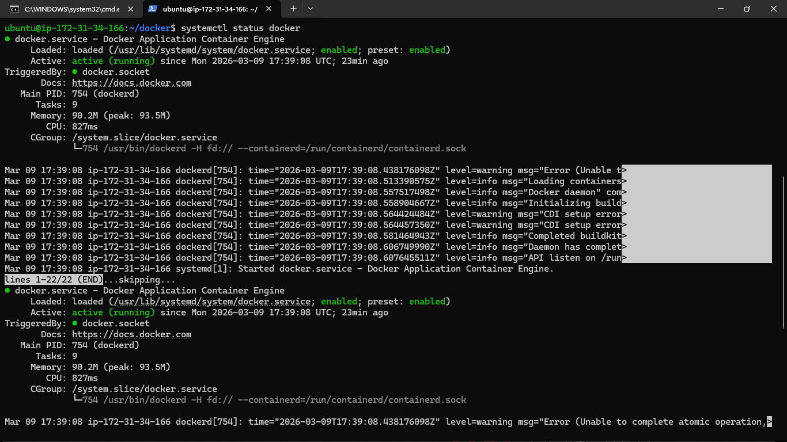
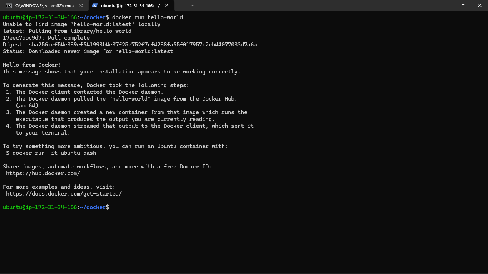
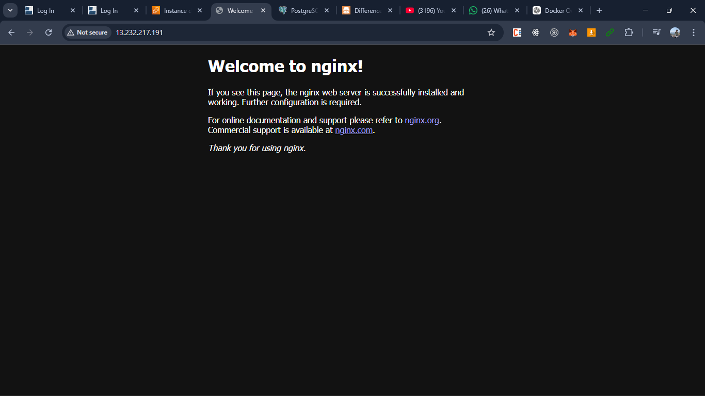
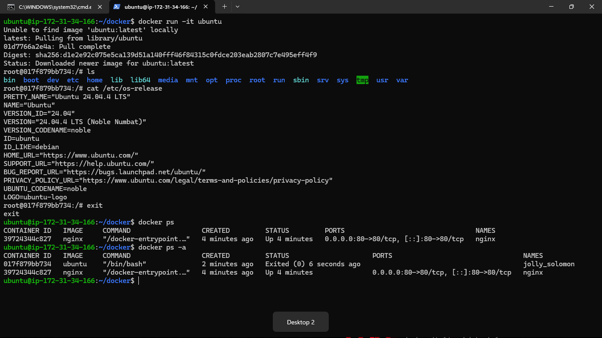
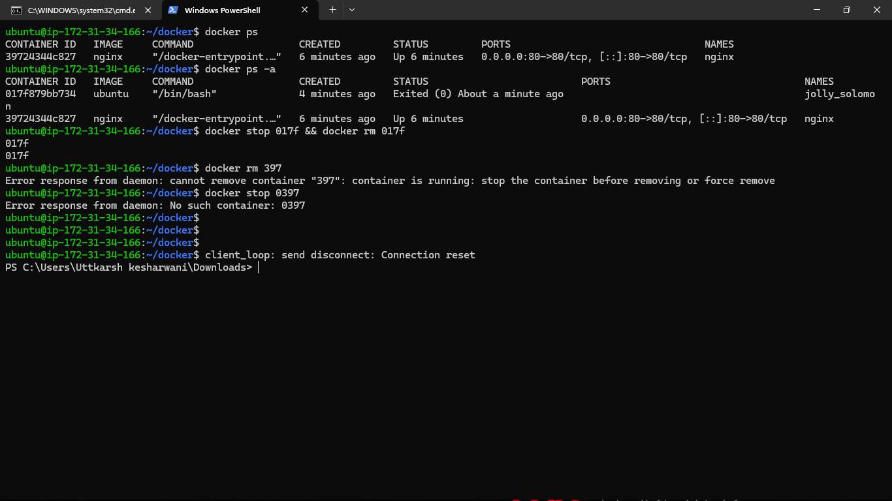
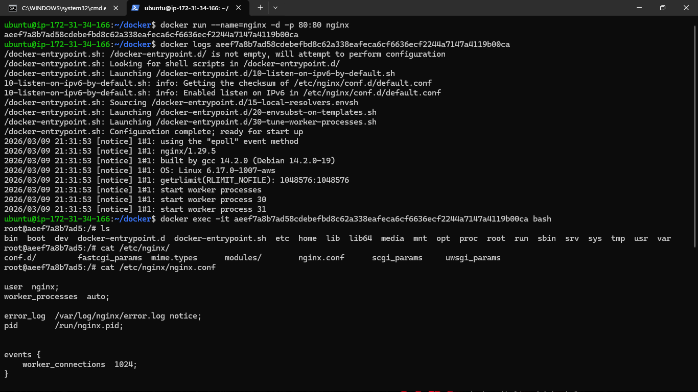

### Task 1: What is Docker?
Research and write short notes on:

1. What is a container and why do we need them?
- Containers are the lightweight portable executable unit that has all your code , runtime env , dependience etc inside the container and run in isolated environment so that your app can run easily regardless of any host operationg system

2. Containers vs Virtual Machines — what's the real difference?
Virtual Machines run a complete operating system for each instance, which makes them heavy and slow.
Containers, on the other hand, share the host operating system kernel, making them lightweight, faster to start, and more efficient in terms of resource usage.

3. What is the Docker architecture? (daemon, client, images, containers, registry)
Docker follows a client–server architecture. The Docker Client is used to send commands like build or run. The Docker Daemon executes these commands and manages containers. Docker Images are templates used to create containers. Containers are running instances of images. A Docker Registry (like Docker Hub) is used to store and share Docker images.

### Task 2: Install Docker
1. Install Docker on your machine (or use a cloud instance)
2. Verify the installation
3. Run the `hello-world` container
4. Read the output carefully — it explains what just happened

### Task 3: Run Real Containers
1. Run an **Nginx** container and access it in your browser
2. Run an **Ubuntu** container in interactive mode — explore it like a mini Linux machine
3. List all running containers
4. List all containers (including stopped ones)
5. Stop and remove a container

### Task 4: Explore
1. Run a container in **detached mode** — what's different?
2. Give a container a custom **name**
3. Map a **port** from the container to your host
4. Check **logs** of a running container
5. Run a command **inside** a running container

