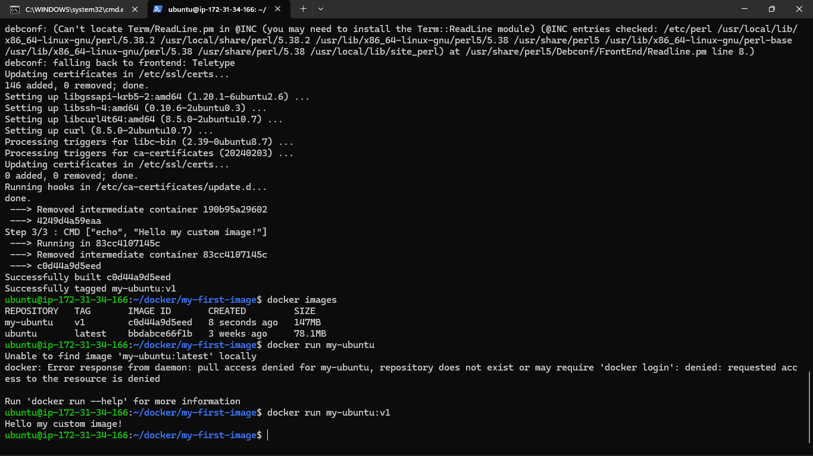
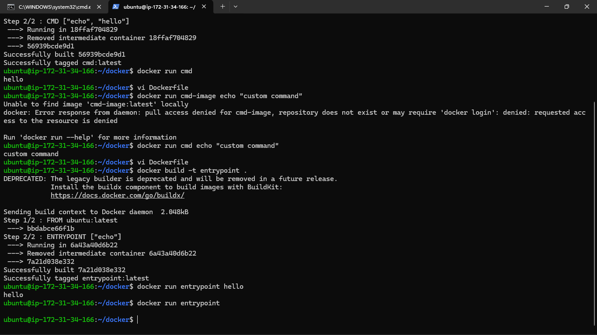
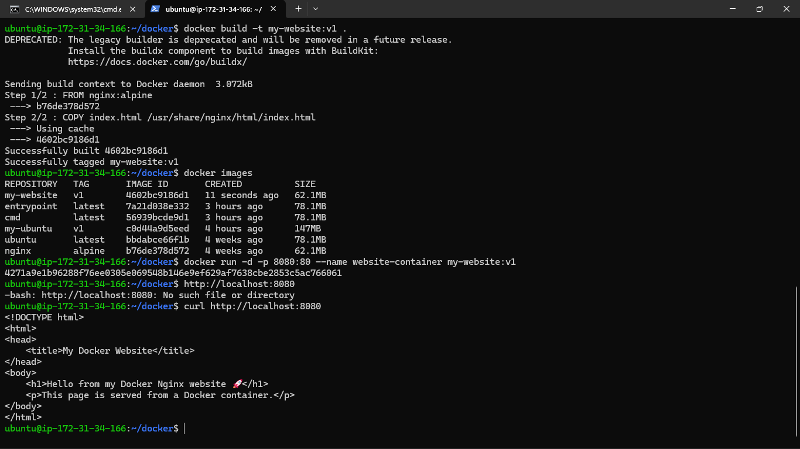
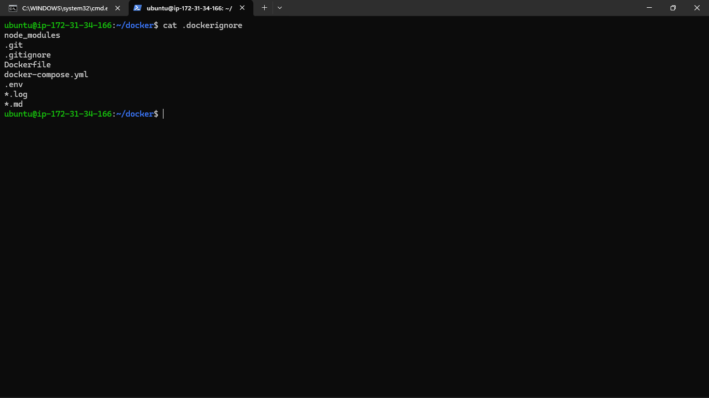
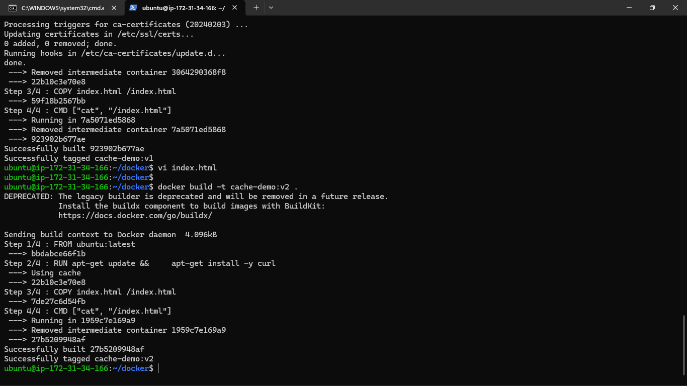

### Task 1: Your First Dockerfile
1. Create a folder called `my-first-image`
2. Inside it, create a `Dockerfile` that:
   - Uses `ubuntu` as the base image
   - Installs `curl`
   - Sets a default command to print `"Hello from my custom image!"`
3. Build the image and tag it `my-ubuntu:v1`
4. Run a container from your image

**Verify:** The message prints on `docker run`




### Task 2: Dockerfile Instructions
Create a new Dockerfile that uses **all** of these instructions:
- `FROM` — base image
- `RUN` — execute commands during build
- `COPY` — copy files from host to image
- `WORKDIR` — set working directory
- `EXPOSE` — document the port
- `CMD` — default command

Build and run it. Understand what each line does.

``` text

  FROM node:alpine

  WORKDIR /app

  COPY package*.json .

  RUN npm install

  COPY . .

  EXPOSE 5000

  CMD ["node", "index.js"]

```


### Task 3: CMD vs ENTRYPOINT
1. Create an image with `CMD ["echo", "hello"]` — run it, then run it with a custom command. What happens?

- CMD was replaced by the command you passed.

2. Create an image with `ENTRYPOINT ["echo"]` — run it, then run it with additional arguments. What happens?

-  Here arguments are appended, not replaced.

3. Write in your notes: When would you use CMD vs ENTRYPOINT?

- Use CMD when you want to provide a default command that users can override easily.

- Use ENTRYPOINT when you want the container to always run a specific executable.




### Task 4: Build a Simple Web App Image
1. Create a small static HTML file (`index.html`) with any content
2. Write a Dockerfile that:
   - Uses `nginx:alpine` as base
   - Copies your `index.html` to the Nginx web directory
3. Build and tag it `my-website:v1`
4. Run it with port mapping and access it in your browser




### Task 5: .dockerignore
1. Create a `.dockerignore` file in one of your project folders
2. Add entries for: `node_modules`, `.git`, `*.md`, `.env`
3. Build the image — verify that ignored files are not included




### Task 6: Build Optimization
1. Build an image, then change one line and rebuild — notice how Docker uses **cache**
2. Reorder your Dockerfile so that frequently changing lines come **last**

3. Write in your notes: Why does layer order matter for build speed?
- Every step in the dockerfile is treated as the layer in docker , if any of the layer changes all below step will be recreated again from scratch 




