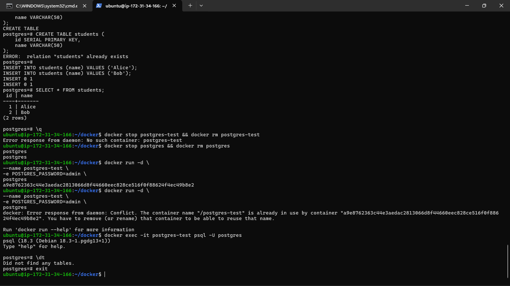
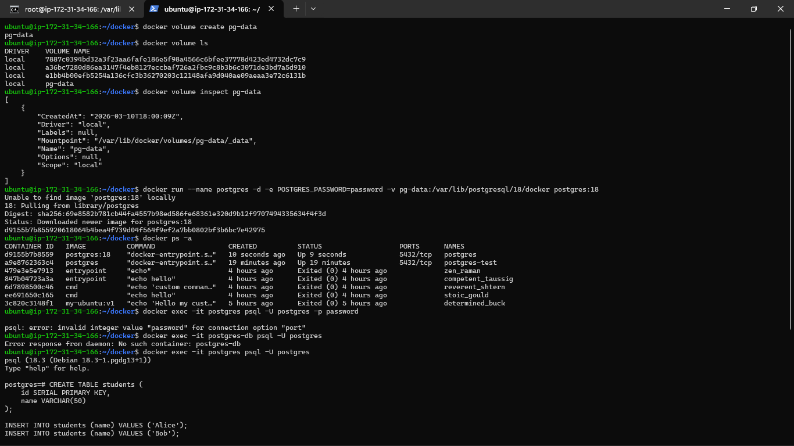
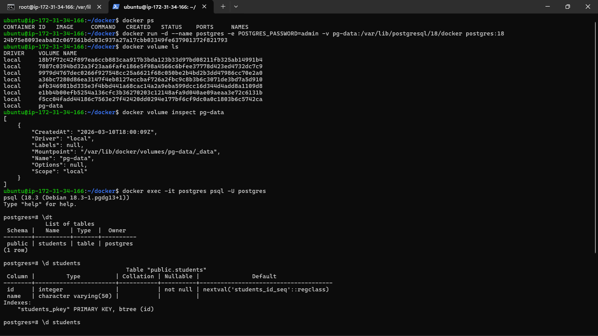
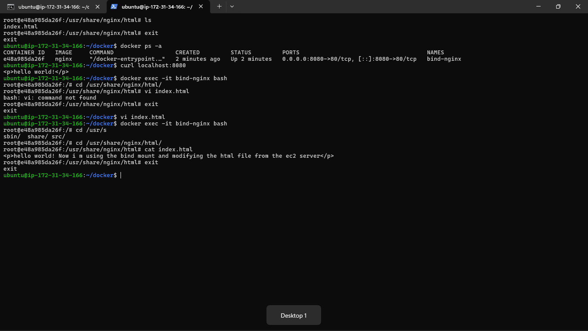
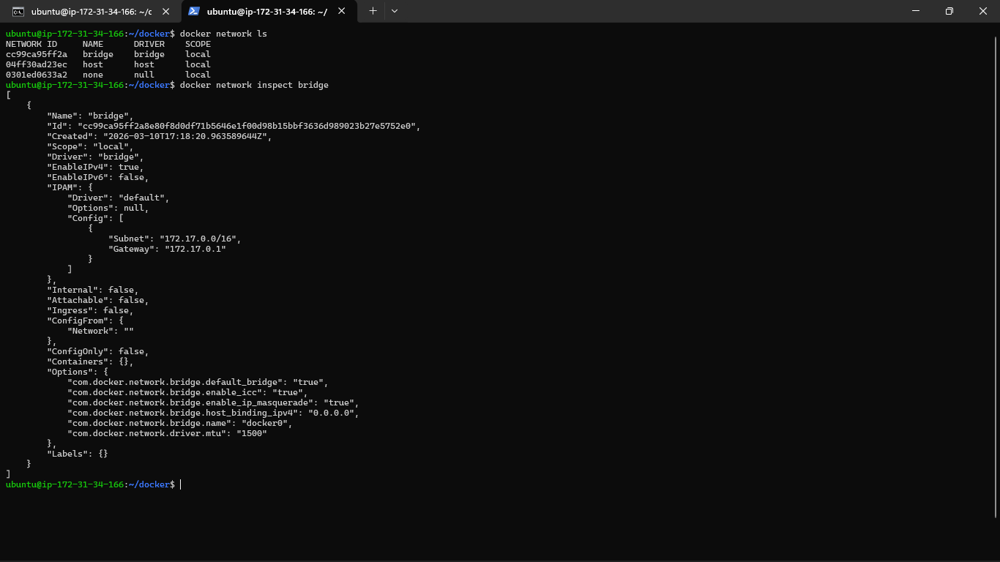
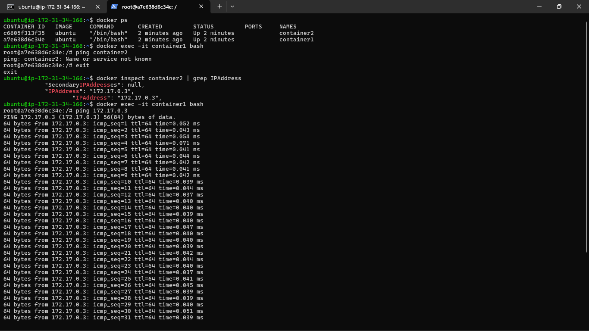
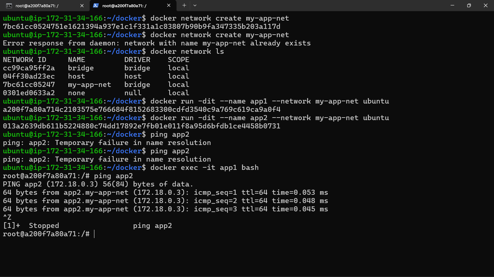
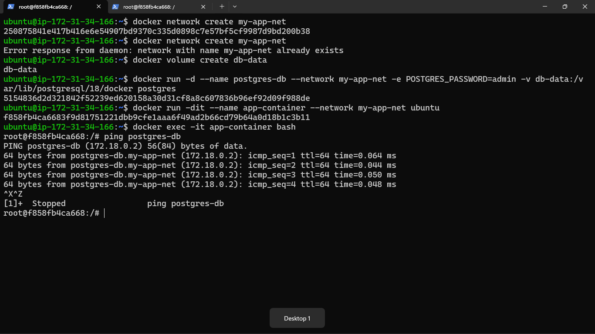

### Task 1: The Problem
1. Run a Postgres or MySQL container
2. Create some data inside it (a table, a few rows — anything)
3. Stop and remove the container
4. Run a new one — is your data still there?

Write what happened and why.
- Docker conatiner are emphereal filesystem , means once the container is removed the filesystem deleted and data is lost , Containers are meant to be stateless. To protect this , we need to create a volumes

### Task 2: Named Volumes
1. Create a named volume
- Volume managed by docker and have a specific name are called given by the user

2. Run the same database container, but this time **attach the volume** to it
3. Add some data, stop and remove the container
4. Run a brand new container with the **same volume**
5. Is the data still there?

**Verify:** `docker volume ls`, `docker volume inspect`

### Task 3: Bind Mounts
1. Create a folder on your host machine with an `index.html` file
2. Run an Nginx container and **bind mount** your folder to the Nginx web directory
3. Access the page in your browser
4. Edit the `index.html` on your host — refresh the browser

Write in your notes: What is the difference between a named volume and a bind mount?

**named volume** 
- Volume managed by docker and have a specific name are called given by the user
- Location is docker storage where data is stored 

**bind mount**
- A bind mount links a specific file or directory on your host machine to a directory inside a container, allowing real-time data synchronization between them
- Location is user host filesystem

## Task 4: Docker Networking Basics
1. List all Docker networks on your machine
2. Inspect the default `bridge` network

3. Run two containers on the default bridge — can they ping each other by **name**?
- The default bridge network does not support automatic DNS resolution.
- Container names are not automatically resolved.
- **note**:- If you create a `custom bridge` network, Docker enables automatic DNS.

4. Run two containers on the default bridge — can they ping each other by **IP**?
- yes they work , they can talk to using the ip on the default bridge
- Containers can communicate using IP, but not name.

Note :- The default network that are created in the docker is bridge network 

### Task 5: Custom Networks
1. Create a custom bridge network called `my-app-net`
2. Run two containers on `my-app-net`
3. Can they ping each other by **name** now?

4. Write in your notes: Why does custom networking allow name-based communication but the default bridge doesn't?

- When you create a custom network, Docker automatically enables an embedded DNS server and give a dns(equal to the name you provided when running the container) and when you make the container user the docker-compose file then the service name become the DNS hostname.

- Custom bridge networks include Docker’s embedded DNS service, which automatically resolves container names to their IP addresses. The default bridge network does not enable this DNS-based service discovery, so containers on the default bridge can only communicate using IP addresses.

### Task 6: Put It Together
1. Create a custom network
2. Run a **database container** (MySQL/Postgres) on that network with a volume for data
3. Run an **app container** (use any image) on the same network
4. Verify the app container can reach the database by container name

