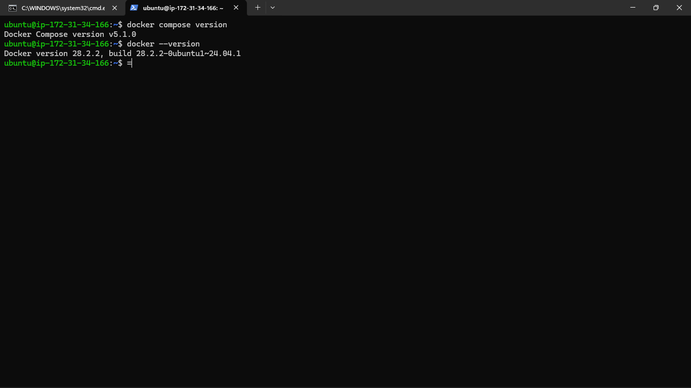
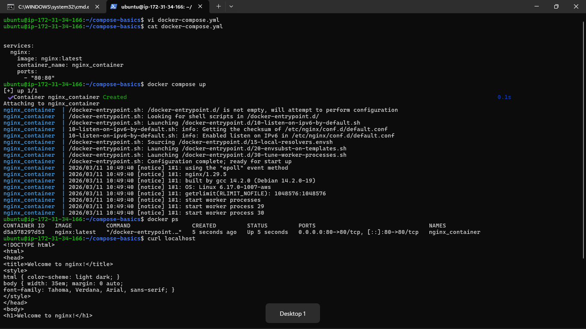
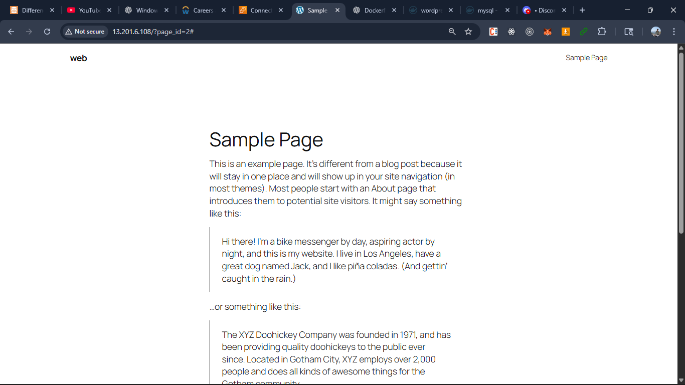
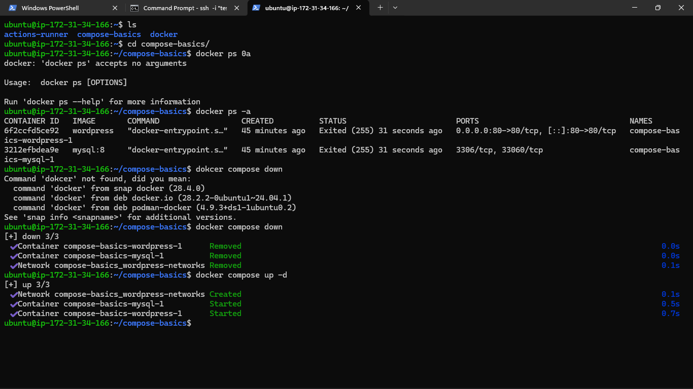
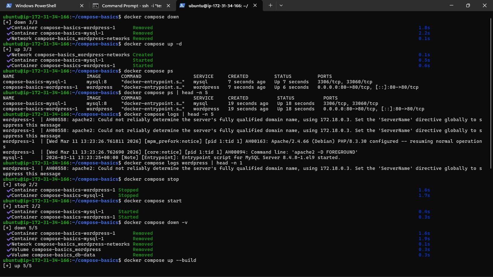
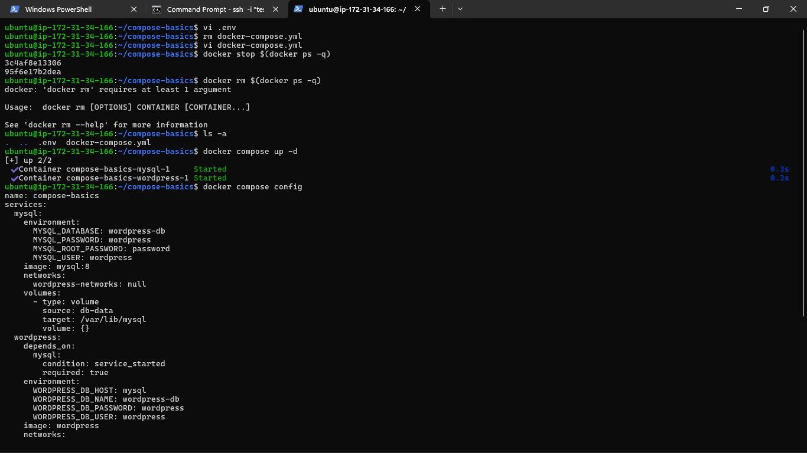

### Task 1: Install & Verify
1. Check if Docker Compose is available on your machine
2. Verify the version

### Task 2: Your First Compose File
1. Create a folder `compose-basics`
2. Write a `docker-compose.yml` that runs a single **Nginx** container with port mapping
3. Start it with `docker compose up`
4. Access it in your browser
5. Stop it with `docker compose down`

### Task 3: Two-Container Setup
Write a `docker-compose.yml` that runs:
- A **WordPress** container
- A **MySQL** container

They should:
- Be on the same network (Compose does this automatically)
- MySQL should have a named volume for data persistence
- WordPress should connect to MySQL using the service name

Start it, access WordPress in your browser, and set it up.

**Verify:** Stop and restart with `docker compose down` and `docker compose up` — is your WordPress data still there?

### Task 4: Compose Commands

Practice and document these:

1. Start services in **detached mode**
  - `docker compose up -d`

2. View running services
  - `docker compose ps `

3. View **logs** of all services
  - `docker compose logs`

4. View logs of a **specific** service
  - `docker compose logs <service_name>`

5. **Stop** services without removing
  - `docker compose stop <service_name>` (for specific service)
  - `docker compose stop` (for all service currently running)

6. **Remove** everything (containers, networks)
    - `docker compose down`

    - `docker compose down -v` (Remove volumes also)

7. **Rebuild** images if you make a change
    - `docker compose up --build`

### Task 5: Environment Variables
1. Add environment variables directly in your `docker-compose.yml`
2. Create a `.env` file and reference variables from it in your compose file
3. Verify the variables are being picked up

