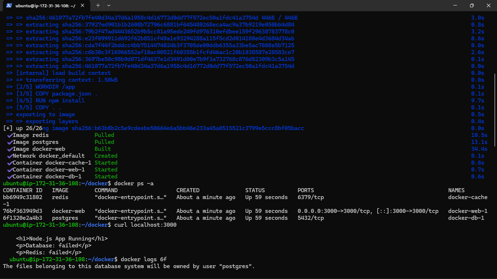
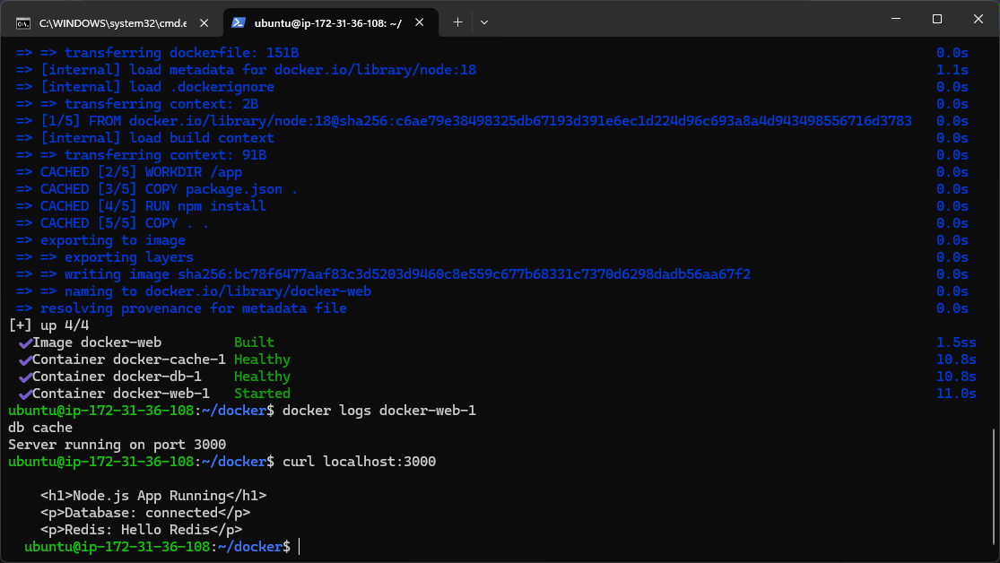
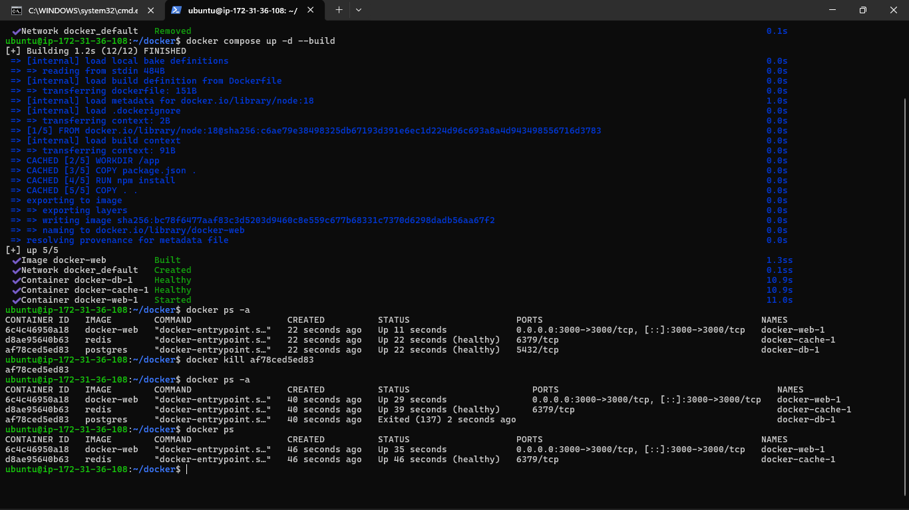
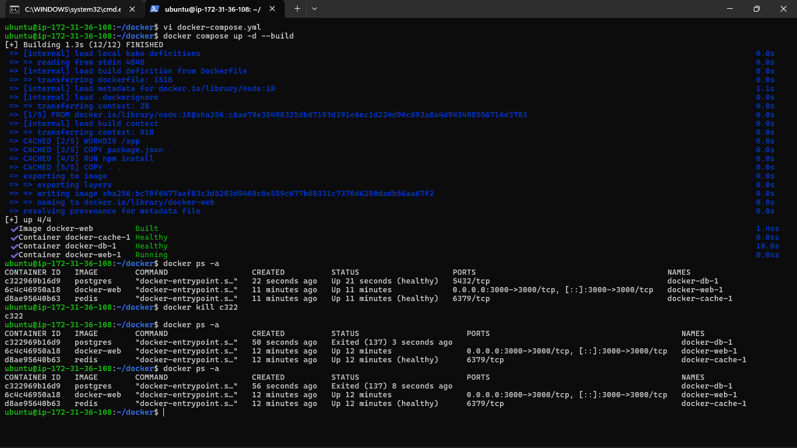
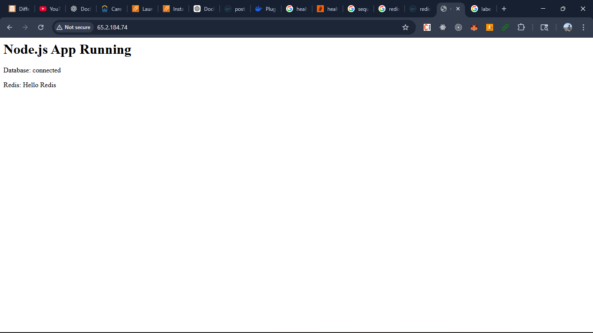

### Task 1: Build Your Own App Stack
Create a `docker-compose.yml` for a 3-service stack:
- A **web app** (use Python Flask, Node.js, or any language you know)
- A **database** (Postgres or MySQL)
- A **cache** (Redis)

Write a simple Dockerfile for the web app. The app doesn't need to be complex — even a "Hello World" that connects to the database is enough.

### Task 2: depends_on & Healthchecks
1. Add `depends_on` to your compose file so the app starts **after** the database
2. Add a **healthcheck** on the database service
3. Use `depends_on` with `condition: service_healthy` so the app waits for the database to be truly ready, not just started

**Test:** Bring everything down and up — does the app wait for the DB?
- yes 

### Task 3: Restart Policies
1. Add `restart: always` to your database service
2. Manually kill the database container — does it come back?
3. Try `restart: on-failure` — how is it different?

4. Write in your notes: When would you use each restart policy?
- Docker always restarts the container, no matter why it stopped. Docker restarts the container only if it exits with an error (non-zero exit code).

### Task 4: Custom Dockerfiles in Compose
1. Instead of using a pre-built image for your app, use `build:` in your compose file to build from a Dockerfile
2. Make a code change in your app
3. Rebuild and restart with one command

 check the build: directive

### Task 5: Named Networks & Volumes
1. Define **explicit networks** in your compose file instead of relying on the default
2. Define **named volumes** for database data
3. Add **labels** to your services for better organization

 

### Task 6: Scaling (Bonus)

1. Try scaling your web app to 3 replicas using `docker compose up --scale`
-  `docker compose up -d --build --scale web=3`

2. What happens? What breaks?
- Port mapping conflict occurs and only one container up and running and other container only created but not running 

3. Write in your notes: Why doesn't simple scaling work with port mapping?
-  Everything is fine , but the web container will not up and running it only created and port binding for container will become conflict , since only one container can bind the port with the host machine

 
