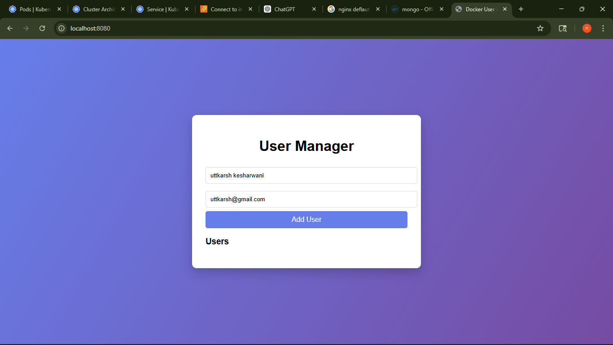
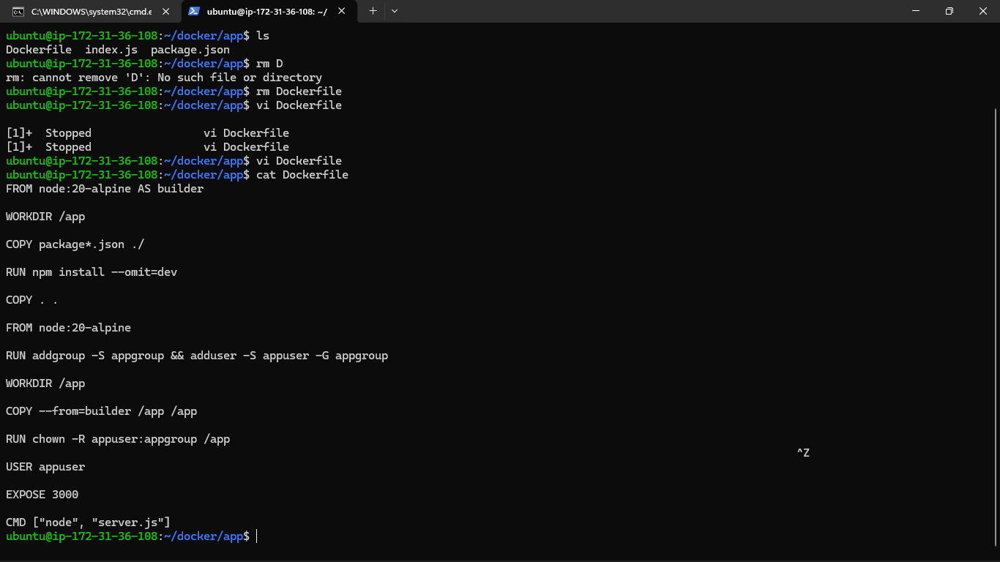
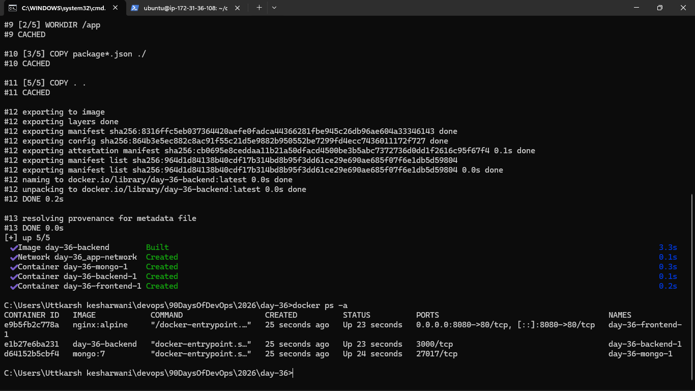
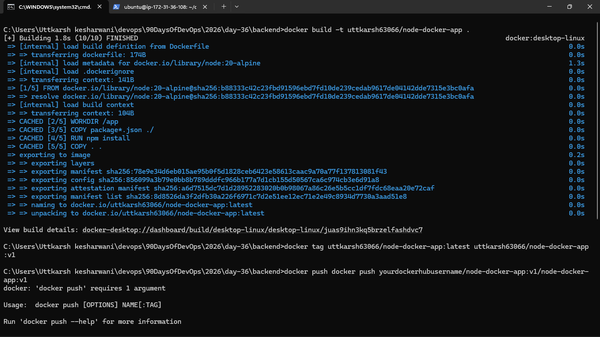
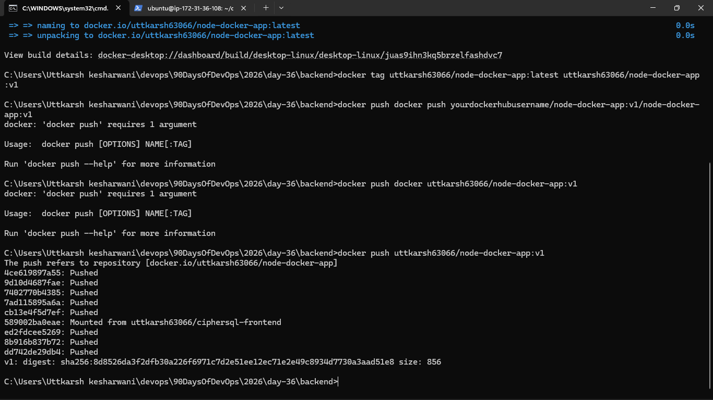
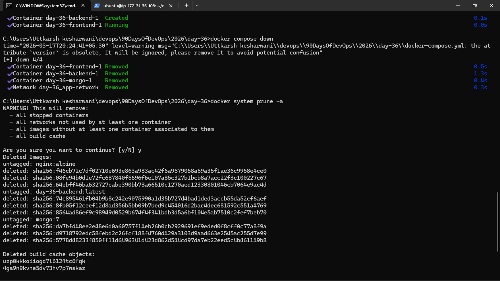

### Task 1: Pick Your App
Choose **one** of these (or use your own project):
- A **Python Flask/Django** app with a database
- A **Node.js Express** app with MongoDB
- A **static website** served by Nginx with a backend API
- Any app from your GitHub that doesn't have Docker yet

If you don't have an app, clone a simple open-source one and Dockerize it.

### Task 2: Write the Dockerfile
1. Create a Dockerfile for your application
2. Use a **multi-stage build** if applicable
3. Use a **non-root user**
4. Keep the image **small** — use alpine or slim base images
5. Add a `.dockerignore` file

### Task 3: Add Docker Compose
Write a `docker-compose.yml` that includes:
1. Your **app** service (built from Dockerfile)
2. A **database** service (Postgres, MySQL, MongoDB — whatever your app needs)
3. **Volumes** for database persistence
4. A **custom network**
5. **Environment variables** for configuration (use `.env` file)
6. **Healthchecks** on the database

### Task 4: Ship It
1. Tag your app image
2. Push it to Docker Hub
3. Share the Docker Hub link
4. Write a `README.md` in your project with:
   - What the app does
   - How to run it with Docker Compose
   - Any environment variables needed

Docker hub link :- 
https://hub.docker.com/layers/uttkarsh63066/node-docker-app/v1/images/sha256:78e9e34d6eb015ae95b0f5d1828ceb6423e58613caac9a70a77f137813081f43?uuid=5796BCD6-1350-44EA-A48D-BB2E7DE3E648

### Task 5: Test the Whole Flow
1. Remove all local images and containers
2. Pull from Docker Hub and run using only your compose file
3. Does it work fresh? If not — fix it until it does

