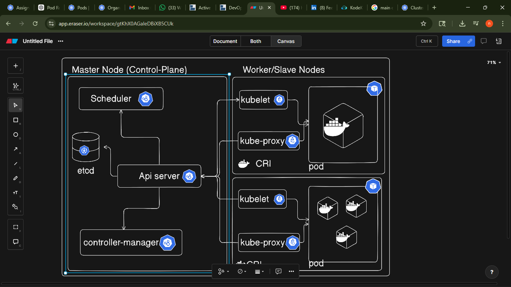
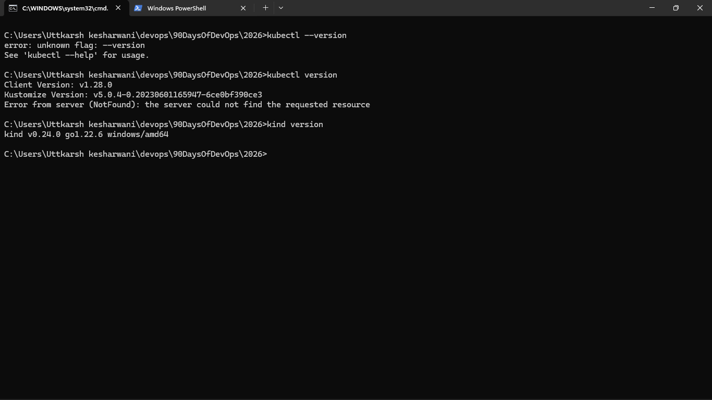
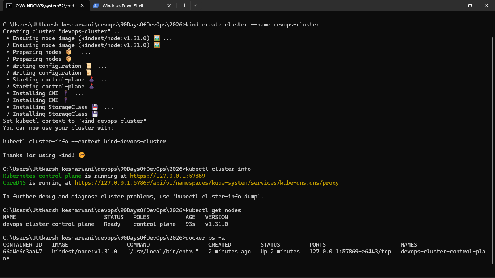
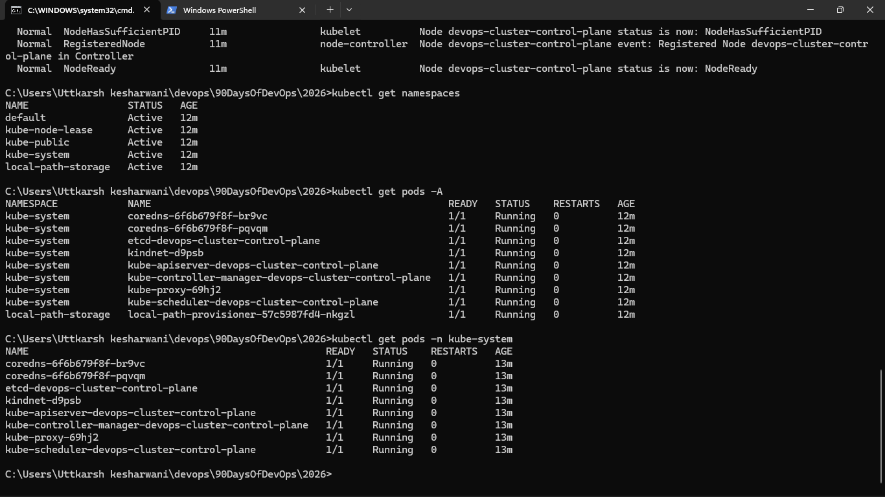
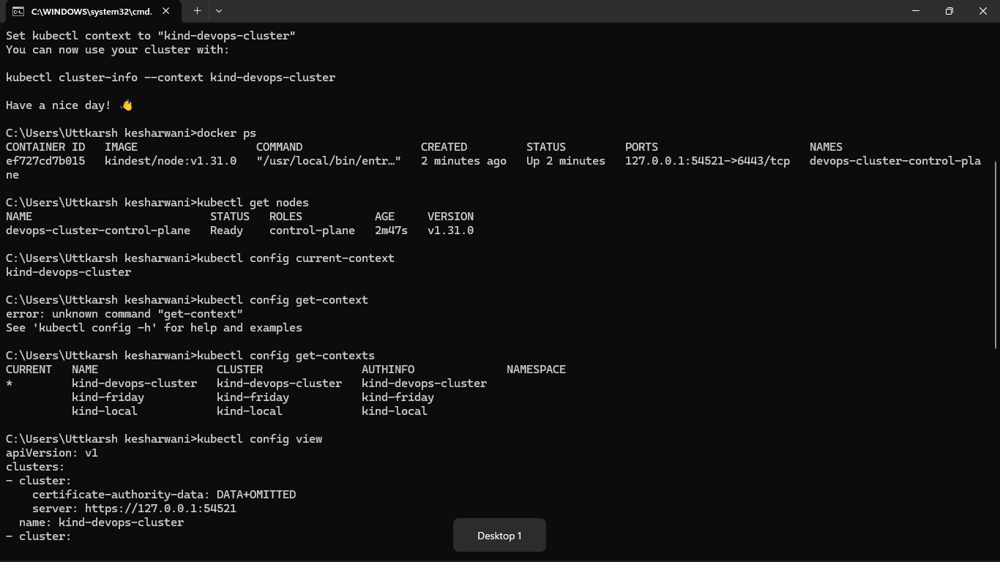

# Point to learn
A Kubernetes worker node contains three main components: kubelet, container runtime interface (CRI), and kube-proxy.
- Kubelet communicates with the control plane and manages pods on the node.
- The container runtime is responsible for running containers.
- Kube-proxy manages networking and enables communication between services and pods.

- Every node runs kube-proxy.Its job is to route traffic from Services to the correct Pods.

- kube-proxy is a networking component in Kubernetes that runs on each worker node and manages network rules to allow communication between services and pods, as well as load balancing traffic across pods.

Link:- https://dev.to/itsmecharan7/problems-with-docker-4735
### Task 1: Recall the Kubernetes Story
Before touching a terminal, write down from memory:

1. Why was Kubernetes created? What problem does it solve that Docker alone cannot?
- Google needs a way to managed it container so they created Borg(a platform that manage multiple container), so they open-sourced it the borg and then later they changed this name to kuberentes.
=> It solve multiple problem that docker alone cant solve like deployment of multiple container over the cluster , rollback , auto-healing , auto-scaling , rollback and many other things.  

2. Who created Kubernetes and what was it inspired by?
- Google created kubernetes and it was inspired by the Borg , Borg was Google's first unified container management system. It managed "hundreds of thousands of jobs" across many machines, acting as a central brain for running containerized workloads.

3. What does the name "Kubernetes" mean?
-  kuberentes means "captain" in english. means managing the multiple container run by the docker 

### Task 2: Draw the Kubernetes Architecture

### Task 3: Install kubectl

### Task 4: Set Up Your Local Cluster(kind)

Write down: Which one did you choose and why?
- I choosse kind over minikube because i m more familier with docker and Kind uses Docker containers as nodes, making it exceptionally fast and ideal for CI/CD or multi-node testing.

### Task 5: Explore Your Cluster

### Task 6: Practice Cluster Lifecycle

Write down: What is a kubeconfig? Where is it stored on your machine?
- Kubeconfig file is a file which is present `~/.kube/config`, which is used to store cluster info, user credientials ,  authenticate and manage,access your clusters .

