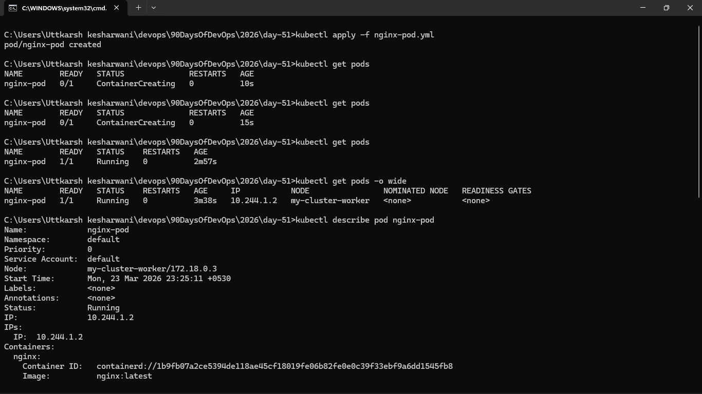
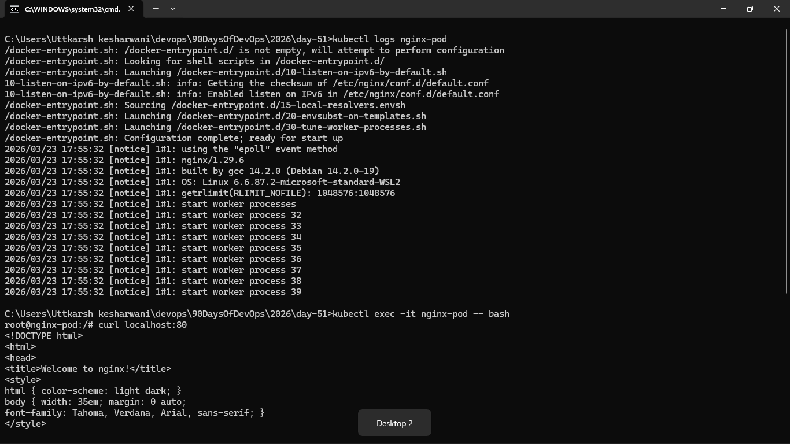
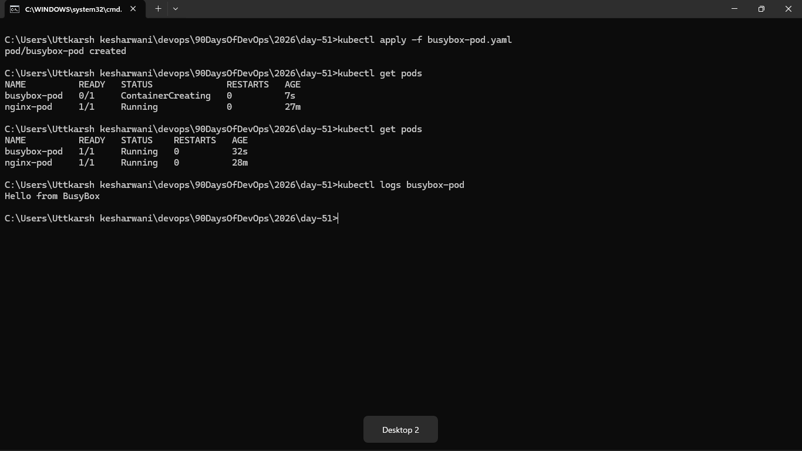
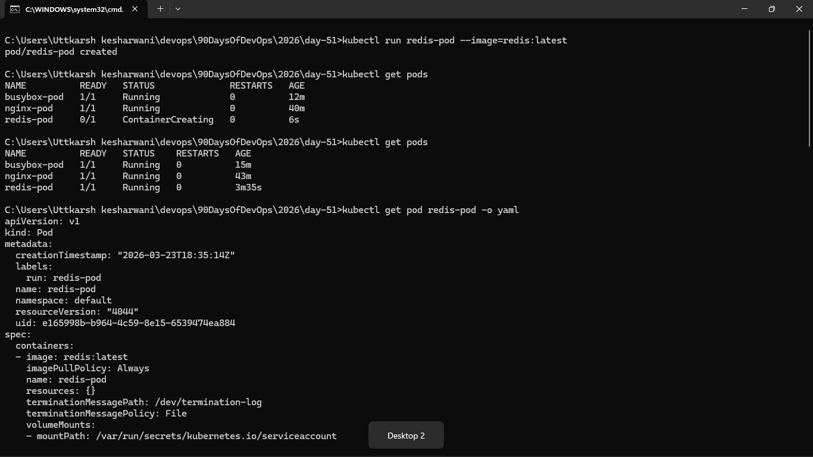
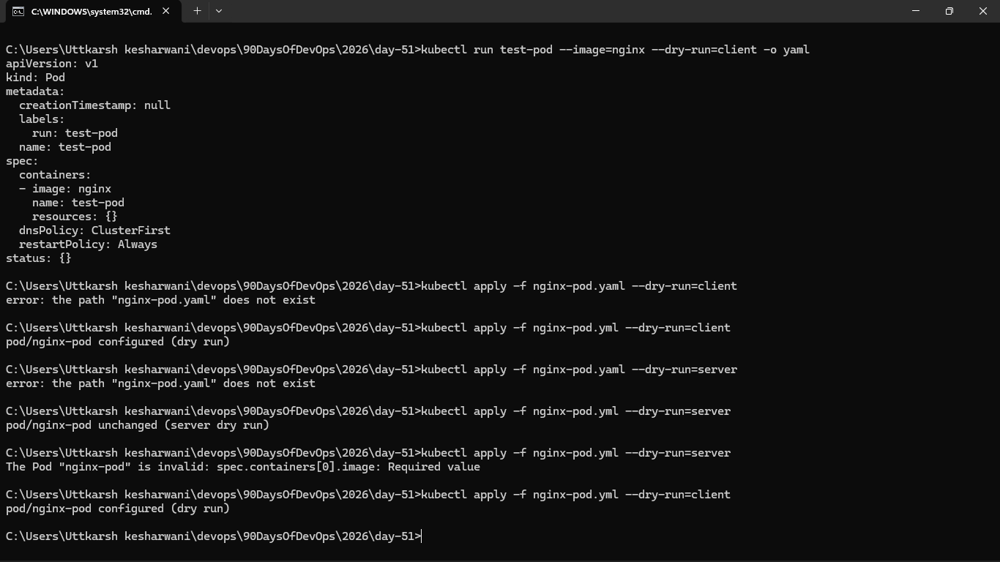
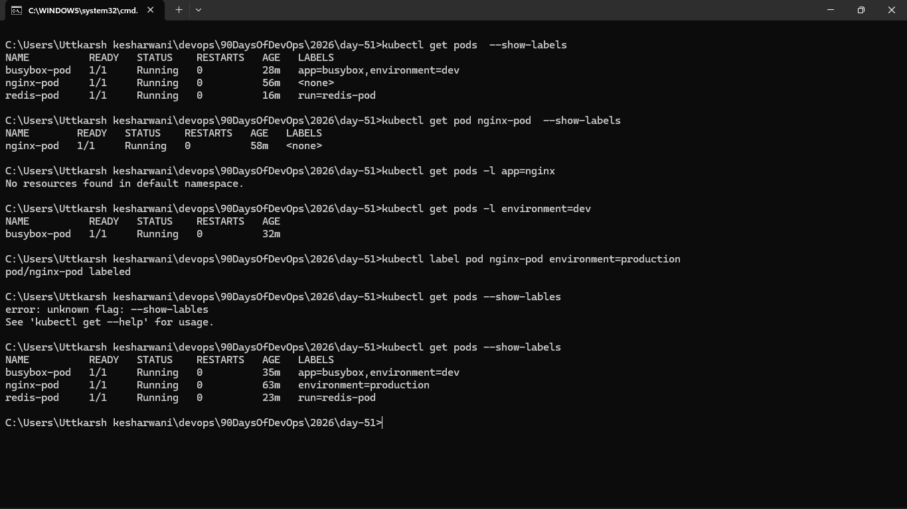
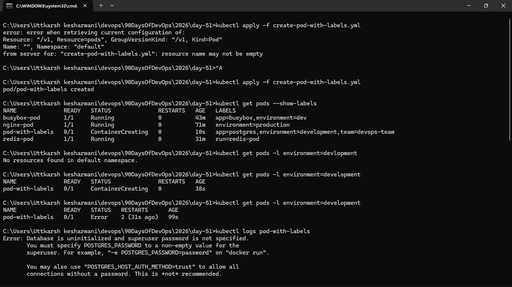
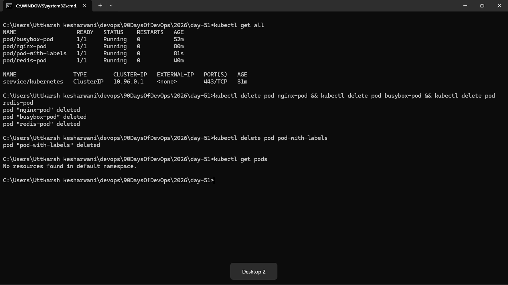

### Task 1: Create Your First Pod (Nginx)
Create a file called `nginx-pod.yaml`:

```yaml
apiVersion: v1
kind: Pod
metadata:
  name: nginx-pod
  labels:
    app: nginx
spec:
  containers:
  - name: nginx
    image: nginx:latest
    ports:
    - containerPort: 80
```

`kubectl get pods -o wide`
- here "o" stands for the output format , "wide" gives some extra details about pods , "yaml" give the configration/manifest made by k8s to create a pod, and many more thing available . 

`kubectl logs nginx-pod` 
- The `kubectl logs nginx-pod` command is used to retrieve the logs from the containers running within the specified pod, if we have multiple contianers running on the same pod then we need to specify the container name using the flag `-c` and for all container `--all-containers=true`

`kubectl exec -it nginx-pod -- /bin/bash`
- if there are multiple container inside the pod then we need to specify using the flag `-c` followed by name-of-the-container





### Task 2: Create a Custom Pod (BusyBox)
Write a new manifest `busybox-pod.yaml` from scratch (do not copy-paste the nginx one):

```yaml
apiVersion: v1
kind: Pod
metadata:
  name: busybox-pod
  labels:
    app: busybox
    environment: dev
spec:
  containers:
  - name: busybox
    image: busybox:latest
    command: ["sh", "-c", "echo Hello from BusyBox && sleep 3600"]
```





### Task 3: Imperative vs Declarative
You have been using the declarative approach (writing YAML, then `kubectl apply`). Kubernetes also supports imperative commands:




### Task 4: Validate Before Applying



### Task 5: Pod Labels and Filtering
Labels are how Kubernetes organizes and selects resources. You added labels in your manifests — now use them:




Write a manifest for a third pod with at least 3 labels (app, environment, team). Apply it and practice filtering.





### Task 6: Clean Up
Delete all the pods you created:




#  What happens when you delete a standalone Pod?
- When we delete the standalone pod it will not recreate automatically .