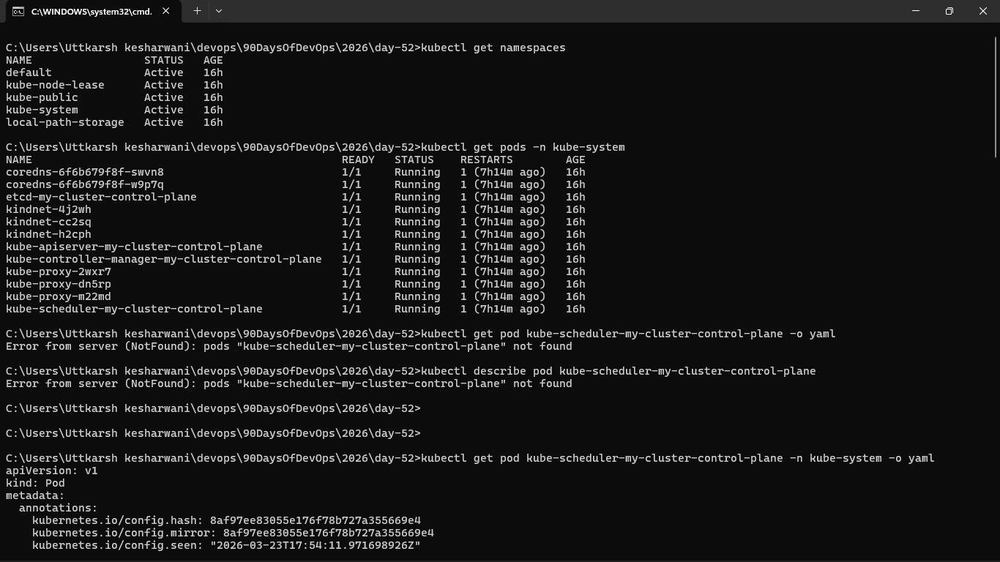
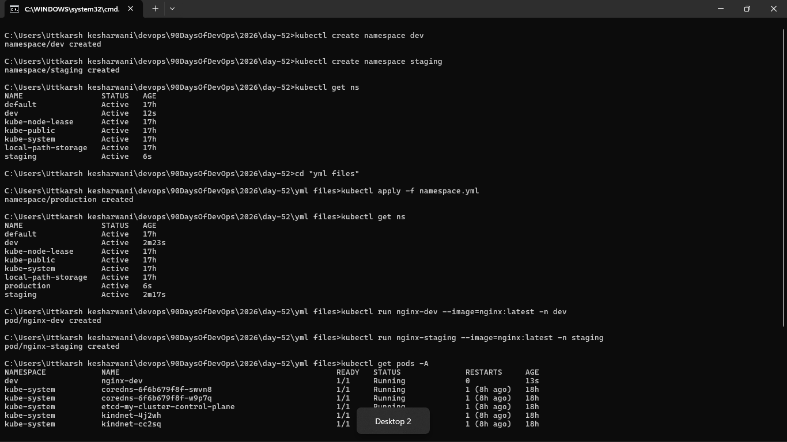
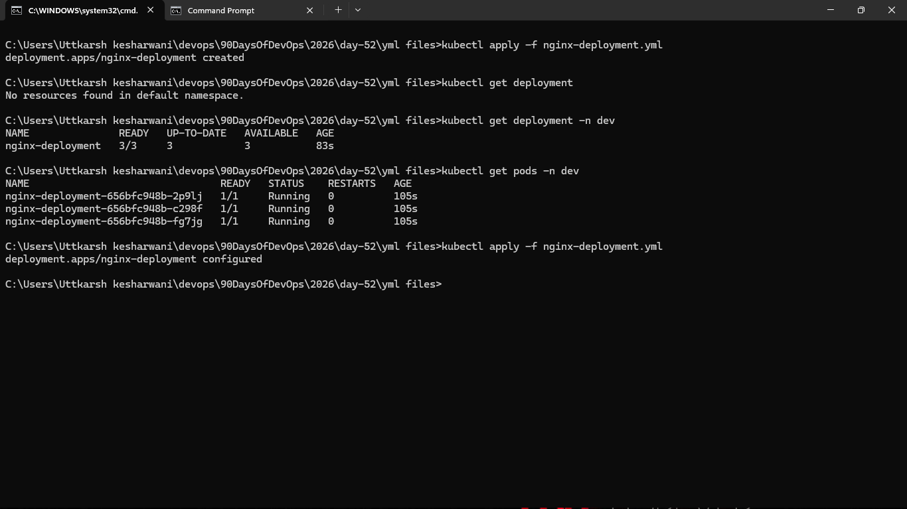
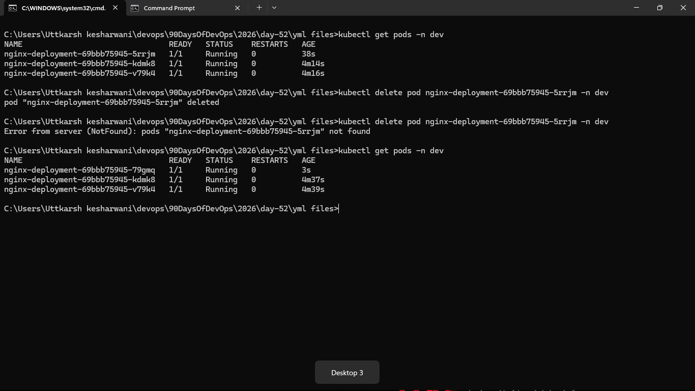
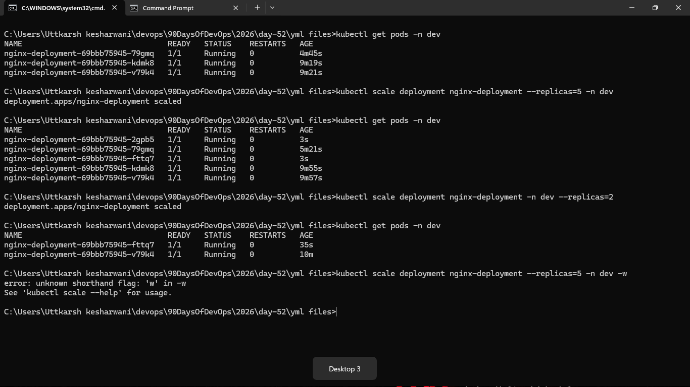
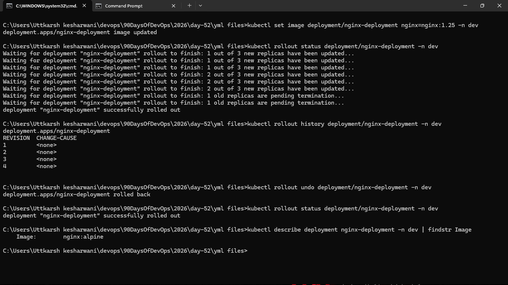

### Task 1: Explore Default Namespaces
Kubernetes comes with built-in namespaces. List them:

### Task 2: Create and Use Custom Namespaces
Create two namespaces — one for a development environment and one for staging:

### Task 3: Create Your First Deployment
A Deployment tells Kubernetes: "I want X replicas of this Pod running at all times." If a Pod crashes, the Deployment controller recreates it automatically.

**Verify:** What do the READY, UP-TO-DATE, and AVAILABLE columns mean in the deployment output?
- READY : 3/3 means (Ready Pods / Desired Pods)
- UP-TO-DATE: Pods using latest deployment spec
- AVAILABLE: Pods available to serve traffic

### Task 4: Self-Healing — Delete a Pod and Watch It Come Back
This is the key difference between a Deployment and a standalone Pod.

### Task 5: Scale the Deployment
Change the number of replicas:

### Task 6: Rolling Update
Update the Nginx image version to trigger a rolling update:

### Task 7: Clean Up

already done 

