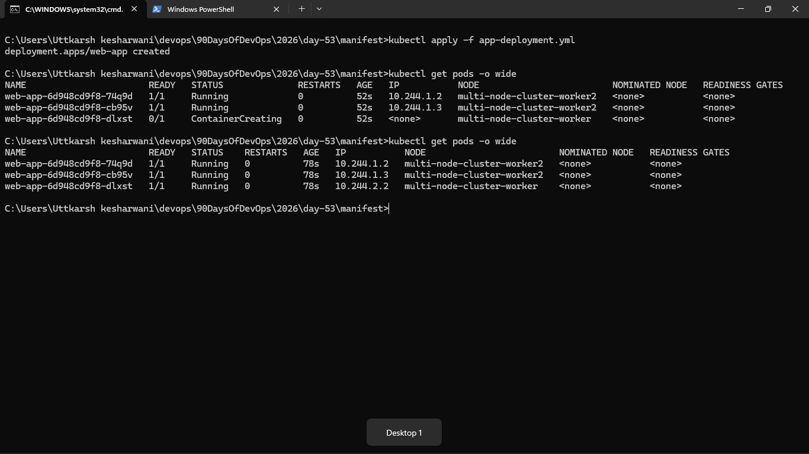
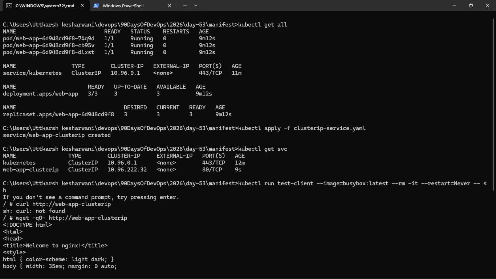
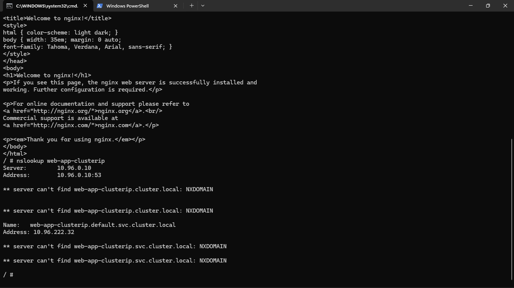
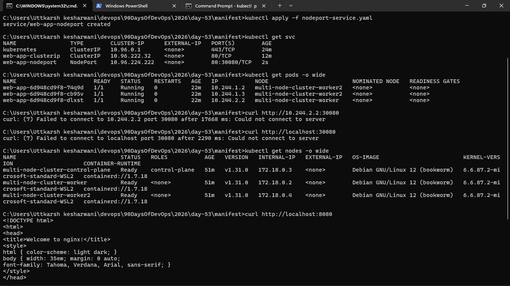
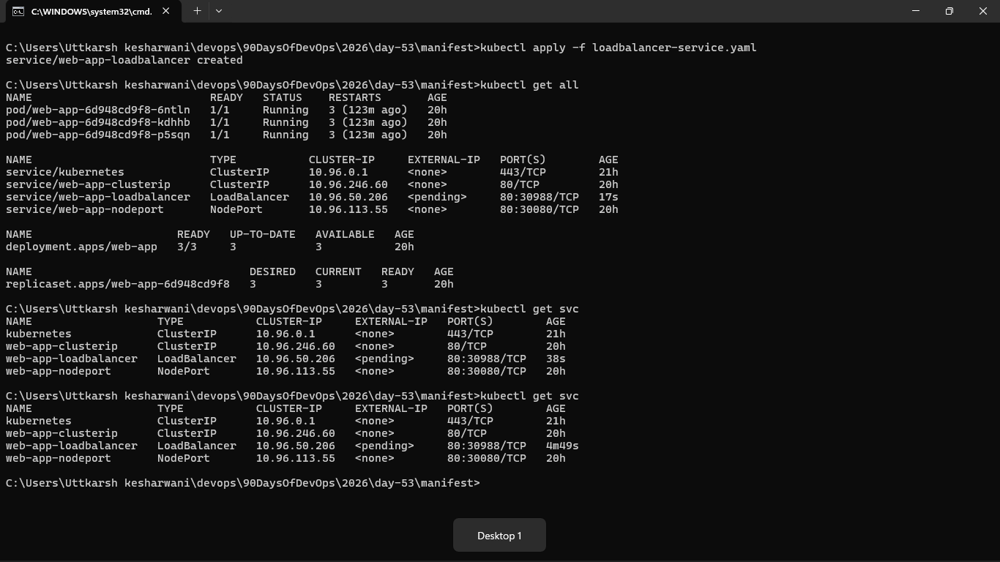
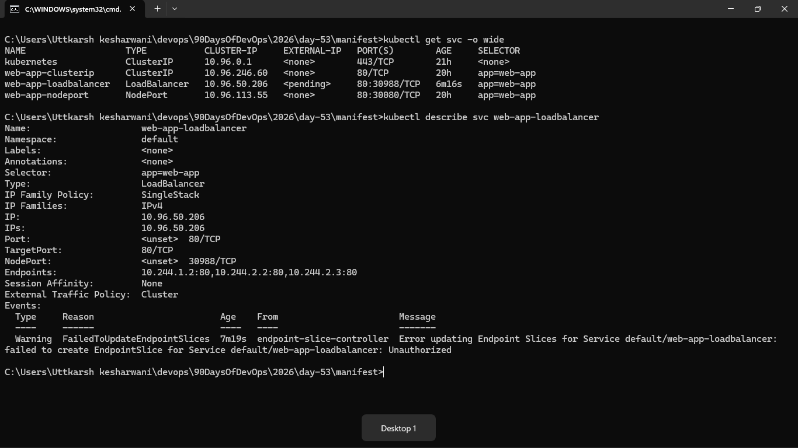
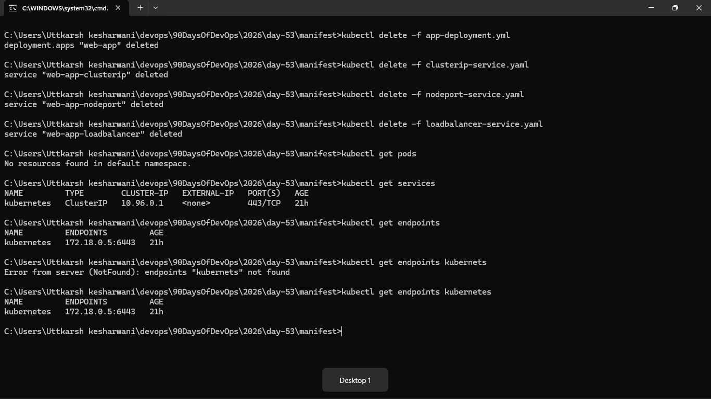

### Task 1: Deploy the Application
First, create a Deployment that you will expose with Services. Create `app-deployment.yaml`:




### Task 2: ClusterIP Service (Internal Access)
ClusterIP is the default Service type. It gives your Pods a stable internal IP that is only reachable from within the cluster.

Create `clusterip-service.yaml`:




### Task 3: Discover Services with DNS
Kubernetes has a built-in DNS server. Every Service gets a DNS entry automatically:




### Task 4: NodePort Service (External Access via Node)
A NodePort Service exposes your application on a port on every node in the cluster. This lets you access the Service from outside the cluster.

Create `nodeport-service.yaml`:





### Task 5: LoadBalancer Service (Cloud External Access)
In a cloud environment (AWS, GCP, Azure), a LoadBalancer Service provisions a real external load balancer that routes traffic to your nodes.

Create `loadbalancer-service.yaml`:




### Task 6: Understand the Service Types Side by Side
Check all three services:




### Task 7: Clean Up
```bash
kubectl delete -f app-deployment.yaml
kubectl delete -f clusterip-service.yaml
kubectl delete -f nodeport-service.yaml
kubectl delete -f loadbalancer-service.yaml

kubectl get pods
kubectl get services
```

