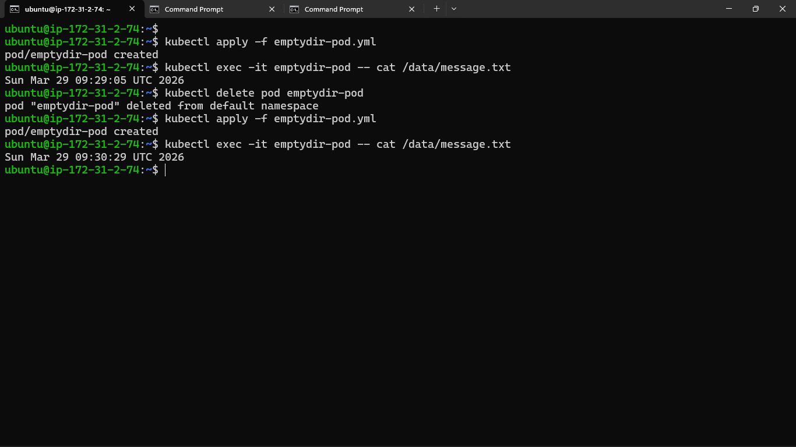
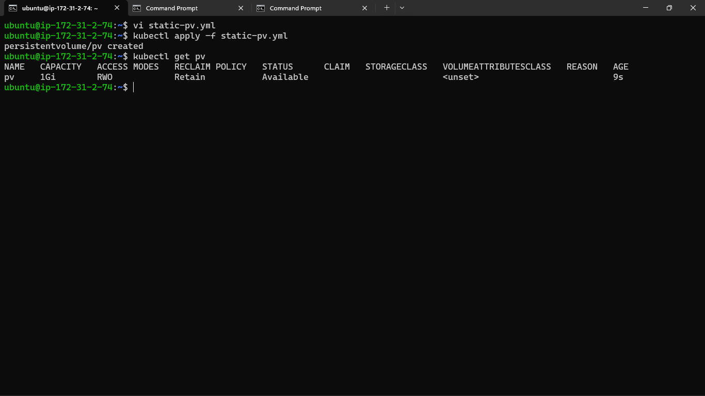
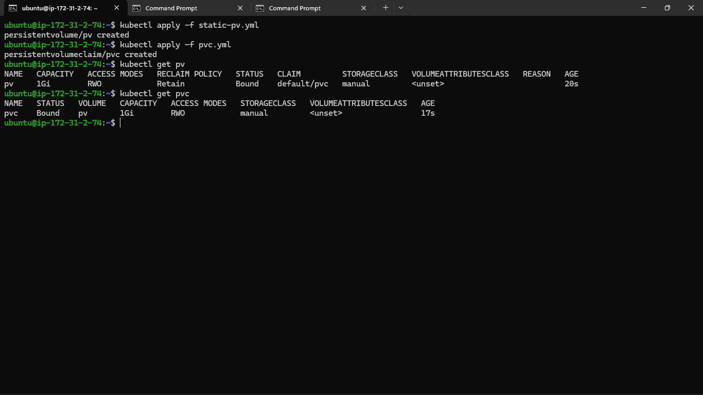
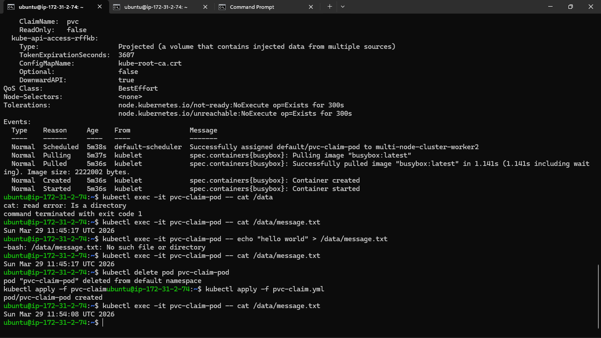
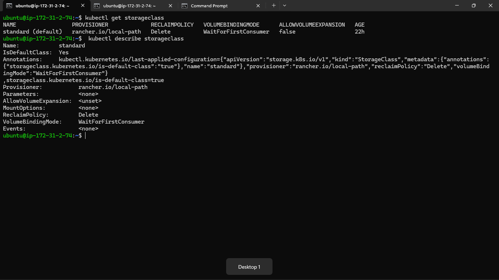
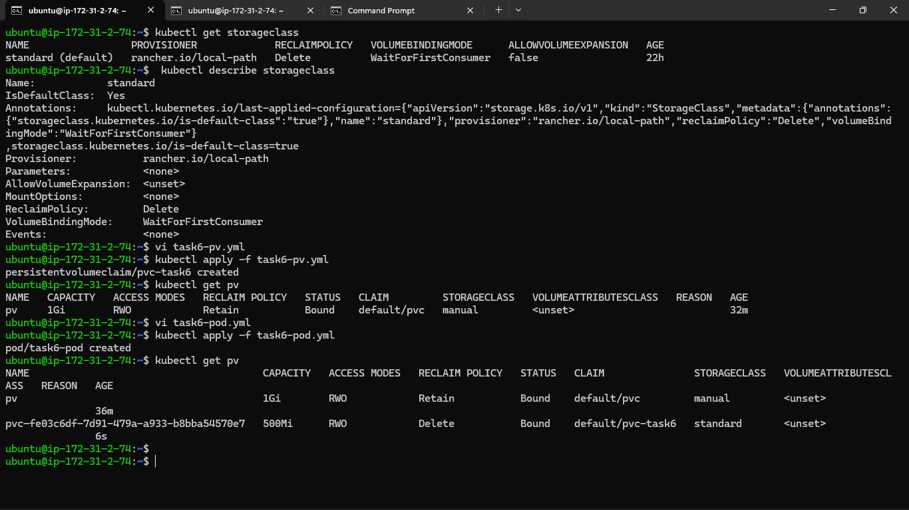
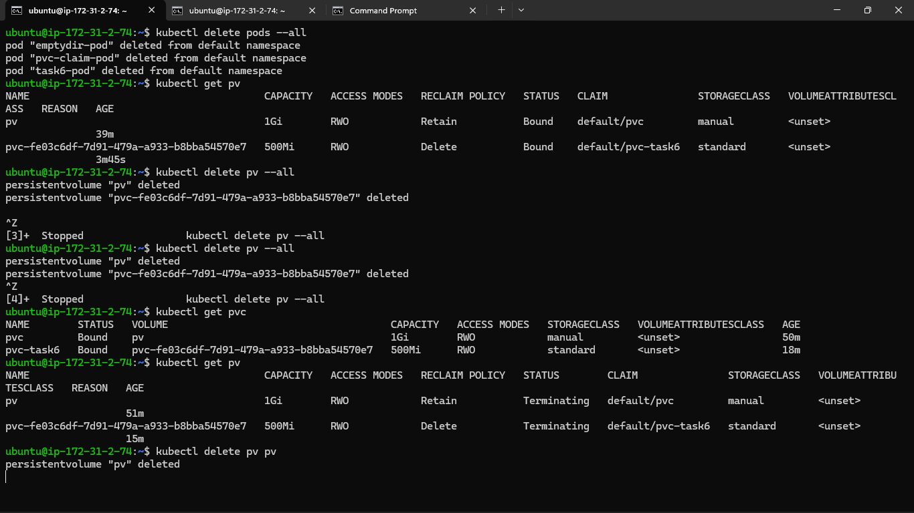

### Task 1: See the Problem — Data Lost on Pod Deletion
1. Write a Pod manifest that uses an `emptyDir` volume and writes a timestamped message to `/data/message.txt`
2. Apply it, verify the data exists with `kubectl exec`
3. Delete the Pod, recreate it, check the file again — the old message is gone

**Verify:** Is the timestamp the same or different after recreation?
- Different 

### Task 2: Create a PersistentVolume (Static Provisioning)
1. Write a PV manifest with `capacity: 1Gi`, `accessModes: ReadWriteOnce`, `persistentVolumeReclaimPolicy: Retain`, and `hostPath` pointing to `/tmp/k8s-pv-data`
2. Apply it and check `kubectl get pv` — status should be `Available`

**Verify:** What is the STATUS of the PV?
- Available

### Task 3: Create a PersistentVolumeClaim
1. Write a PVC manifest requesting `500Mi` of storage with `ReadWriteOnce` access
2. Apply it and check both `kubectl get pvc` and `kubectl get pv`
3. Both should show `Bound` — Kubernetes matched them by capacity and access mode

**Verify:** What does the VOLUME column in `kubectl get pvc` show?
- pv

### Task 4: Use the PVC in a Pod — Data That Survives
1. Write a Pod manifest that mounts the PVC at `/data` using `persistentVolumeClaim.claimName`
2. Write data to `/data/message.txt`, then delete and recreate the Pod
3. Check the file — it should contain data from both Pods

**Verify:** Does the file contain data from both the first and second Pod?

### Task 5: StorageClasses and Dynamic Provisioning
1. Run `kubectl get storageclass` and `kubectl describe storageclass`
2. Note the provisioner, reclaim policy, and volume binding mode
3. With dynamic provisioning, developers only create PVCs — the StorageClass handles PV creation automatically

**Verify:** What is the default StorageClass in your cluster?
- Standard 

### Task 6: Dynamic Provisioning
1. Write a PVC manifest that includes `storageClassName: standard` (or your cluster's default)
2. Apply it — a PV should appear automatically in `kubectl get pv`
3. Use this PVC in a Pod, write data, verify it works

**Verify:** How many PVs exist now? Which was manual, which was dynamic?
- 2 , pv is manual and pvc-fe03c6df-7d91-479a-a933-b8bba54570e7 is dynamic 

### Task 7: Clean Up
1. Delete all pods first
2. Delete PVCs — check `kubectl get pv` to see what happened
3. The dynamic PV is gone (Delete reclaim policy). The manual PV shows `Released` (Retain policy).
4. Delete the remaining PV manually

**Verify:** Which PV was auto-deleted and which was retained? Why?

