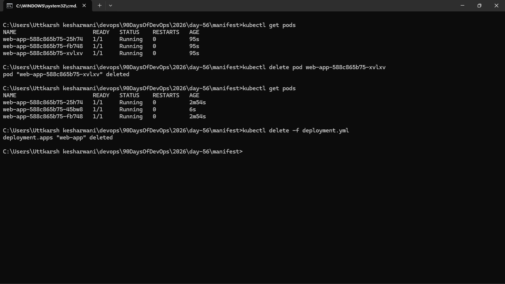
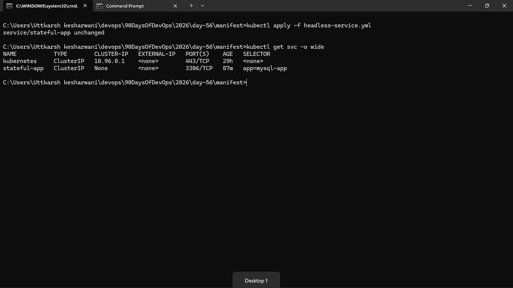
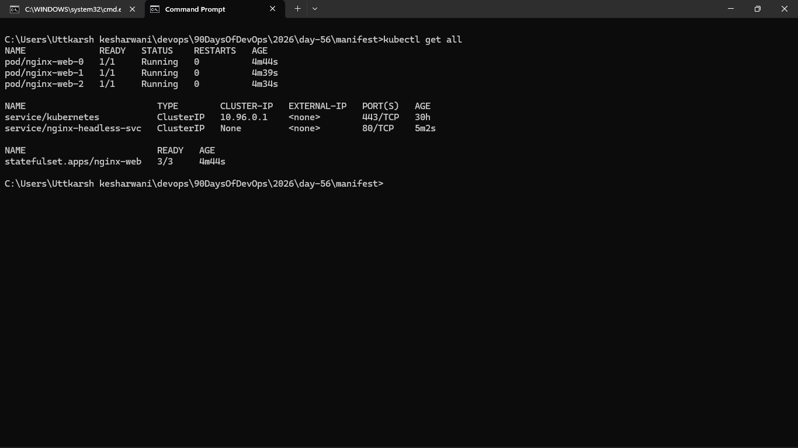
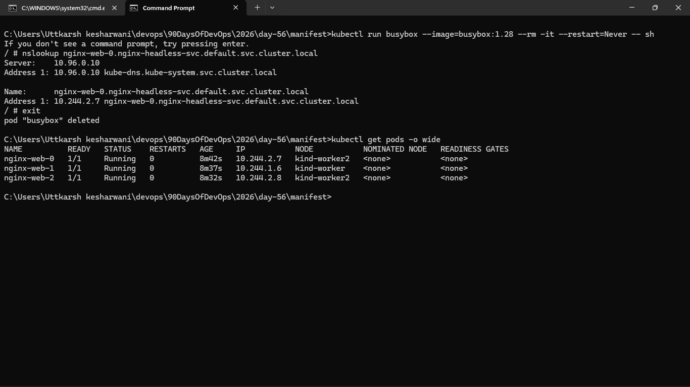
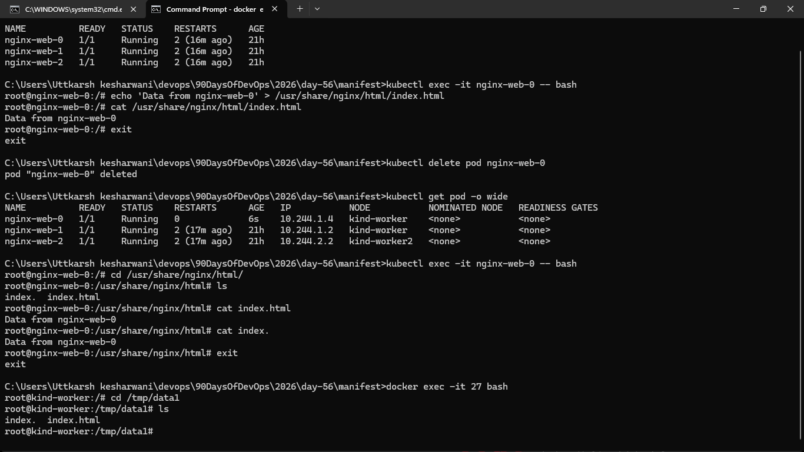
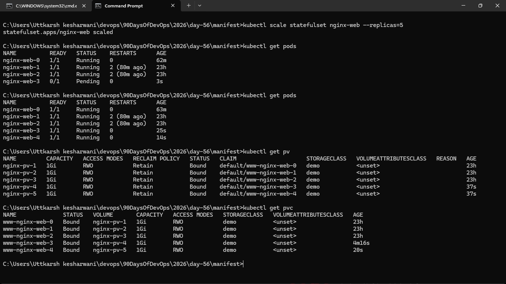
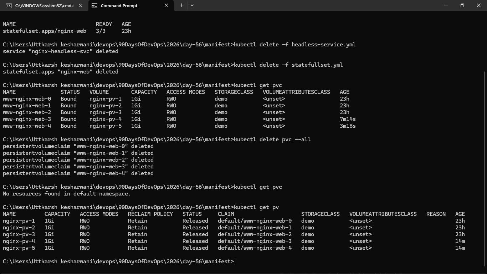

### Task 1: Understand the Problem
1. Create a Deployment with 3 replicas using nginx
2. Check the pod names — they are random (`app-xyz-abc`)
3. Delete a pod and notice the replacement gets a different random name

### Task 2: Create a Headless Service
1. Write a Service manifest with `clusterIP: None` — this is a Headless Service
2. Set the selector to match the labels you will use on your StatefulSet pods
3. Apply it and confirm CLUSTER-IP shows `None`

### Task 3: Create a StatefulSet
1. Write a StatefulSet manifest with `serviceName` pointing to your Headless Service
2. Set replicas to 3, use the nginx image
3. Add a `volumeClaimTemplates` section requesting 100Mi of ReadWriteOnce storage
4. Apply and watch: `kubectl get pods -l <your-label> -w`

### Task 4: Stable Network Identity
Each StatefulSet pod gets a DNS name: `<pod-name>.<service-name>.<namespace>.svc.cluster.local`

1. Run a temporary busybox pod and use `nslookup` to resolve `web-0.<your-headless-service>.default.svc.cluster.local`
2. Do the same for `web-1` and `web-2`
3. Confirm the IPs match `kubectl get pods -o wide`

**Verify:** Does the nslookup IP match the pod IP?

### Task 5: Stable Storage — Data Survives Pod Deletion
1. Write unique data to each pod: `kubectl exec web-0 -- sh -c "echo 'Data from web-0' > /usr/share/nginx/html/index.html"`
2. Delete `web-0`: `kubectl delete pod web-0`
3. Wait for it to come back, then check the data — it should still be "Data from web-0"

### Task 6: Ordered Scaling
1. Scale up to 5: `kubectl scale statefulset web --replicas=5` — pods create in order (web-3, then web-4)
2. Scale down to 3 — pods terminate in reverse order (web-4, then web-3)
3. Check `kubectl get pvc` — all five PVCs still exist. Kubernetes keeps them on scale-down so data is preserved if you scale back up.

**Verify:** After scaling down, how many PVCs exist? -> 5

### Task 7: Clean Up
1. Delete the StatefulSet and the Headless Service
2. Check `kubectl get pvc` — PVCs are still there (safety feature)
3. Delete PVCs manually

**Verify:** Were PVCs auto-deleted with the StatefulSet?

Deployment :- 
1. Used to deploy Stateless applications
2. All pods are created parallelly
3. Pods are deleted randomly
4. Random name is assigned to all pods
5. Same PV is used for all pods
6. Scaling is easy

StatefulSets :- 
1. Used to deploy Stateful applications
2. Pods are created one by one
3. Pods are deleted in reverse order
4. Sticky and predictable name is assigned to the pods
5. Different PVs are used for each pod
6. Scaling is difficult