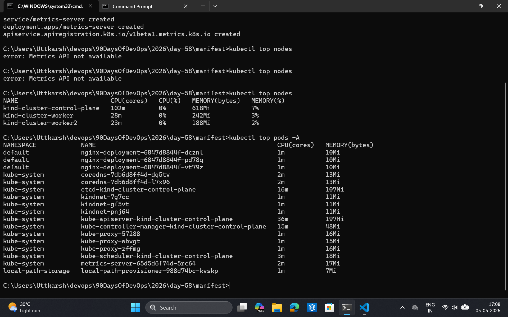
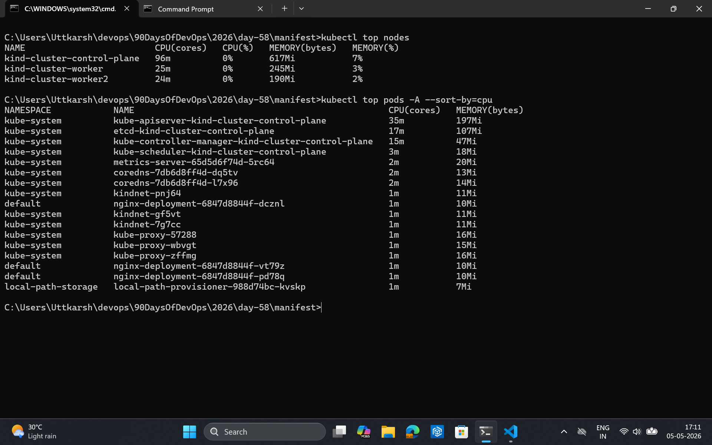
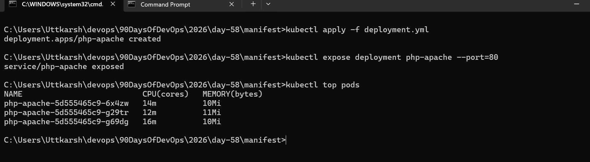
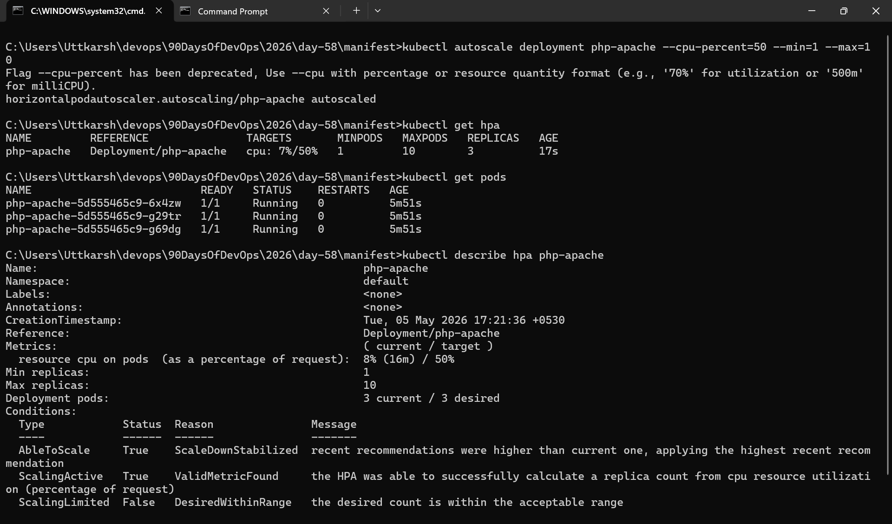
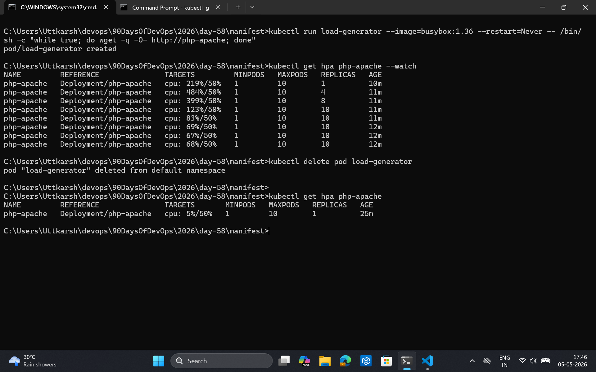
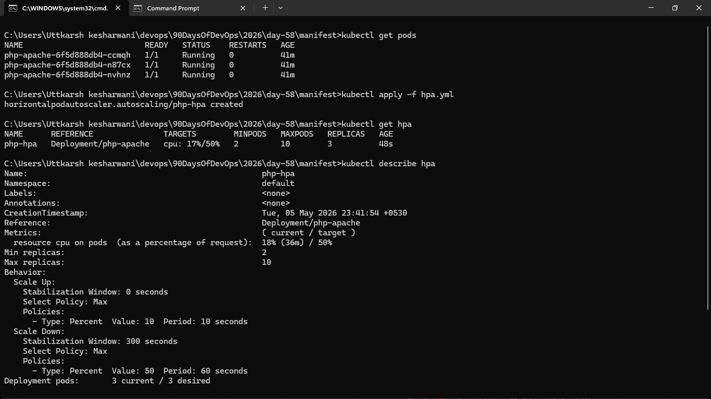

### Task 1: Install the Metrics Server
1. Check if it is already running: `kubectl get pods -n kube-system | grep metrics-server`
2. If not, install it:
   - Minikube: `minikube addons enable metrics-server`
   - Kind/kubeadm: apply the official manifest from the metrics-server GitHub releases
3. On local clusters, you may need the `--kubelet-insecure-tls` flag (never in production)
4. Wait 60 seconds, then verify: `kubectl top nodes` and `kubectl top pods -A`





### Task 2: Explore kubectl top
1. Run `kubectl top nodes`, `kubectl top pods -A`, `kubectl top pods -A --sort-by=cpu`
2. `kubectl top` shows real-time usage, not requests or limits — these are different things
3. Data comes from the Metrics Server, which polls kubelets every 15 seconds




### Task 3: Create a Deployment with CPU Requests
1. Write a Deployment manifest using the `registry.k8s.io/hpa-example` image (a CPU-intensive PHP-Apache server)
2. Set `resources.requests.cpu: 200m` — HPA needs this to calculate utilization percentages
3. Expose it as a Service: `kubectl expose deployment php-apache --port=80`




### Task 4: Create an HPA (Imperative)
1. Run: `kubectl autoscale deployment php-apache --cpu-percent=50 --min=1 --max=10`
2. Check: `kubectl get hpa` and `kubectl describe hpa php-apache`
3. TARGETS may show `<unknown>` initially — wait 30 seconds for metrics to arrive




### Task 5: Generate Load and Watch Autoscaling
1. Start a load generator: `kubectl run load-generator --image=busybox:1.36 --restart=Never -- /bin/sh -c "while true; do wget -q -O- http://php-apache; done"`
2. Watch HPA: `kubectl get hpa php-apache --watch`
3. Over 1-3 minutes, CPU climbs above 50%, replicas increase, CPU stabilizes
4. Stop the load: `kubectl delete pod load-generator`
5. Scale-down is slow (5-minute stabilization window) — you do not need to wait

**Verify:** How many replicas did HPA scale to under load?




### Task 6: Create an HPA from YAML (Declarative)
1. Delete the imperative HPA: `kubectl delete hpa php-apache`
2. Write an HPA manifest using `autoscaling/v2` API with CPU target at 50% utilization
3. Add a `behavior` section to control scale-up speed (no stabilization) and scale-down speed (300 second window)
4. Apply and verify with `kubectl describe hpa`




### Task 7: Clean Up
Delete the HPA, Service, Deployment, and load-generator pod. Leave the Metrics Server installed.

   ``` bash 
      kubectl delete all --all
   ```

   Run the above command

