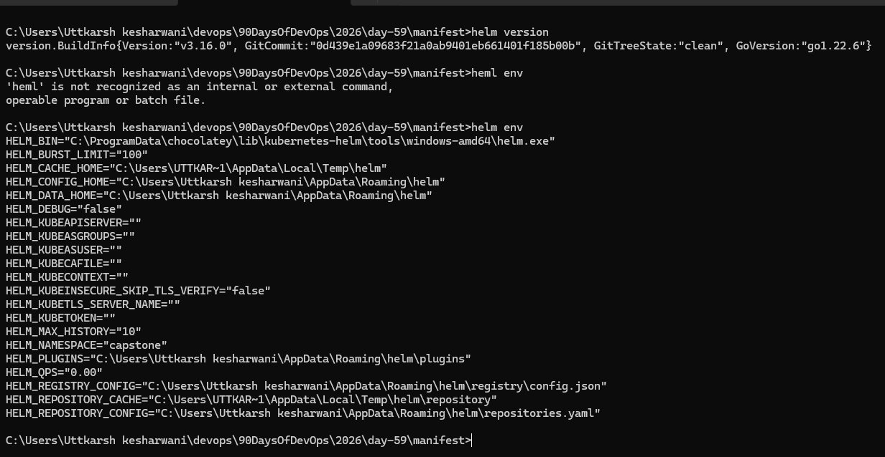
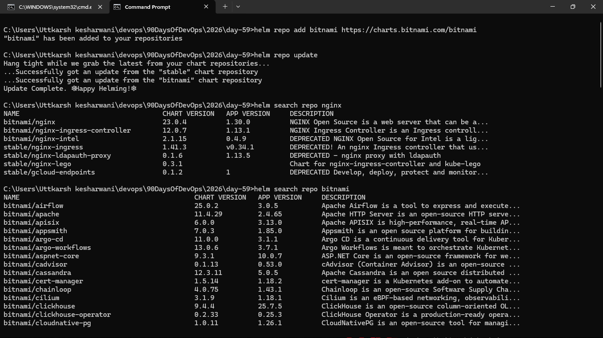
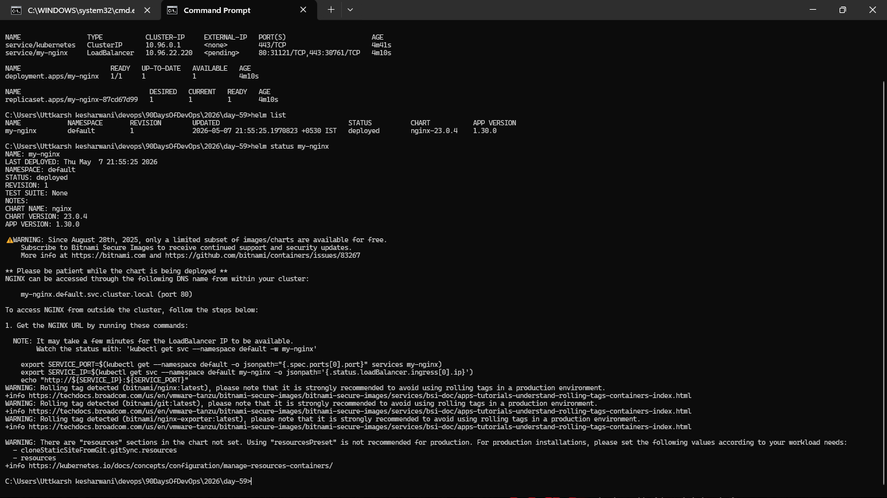
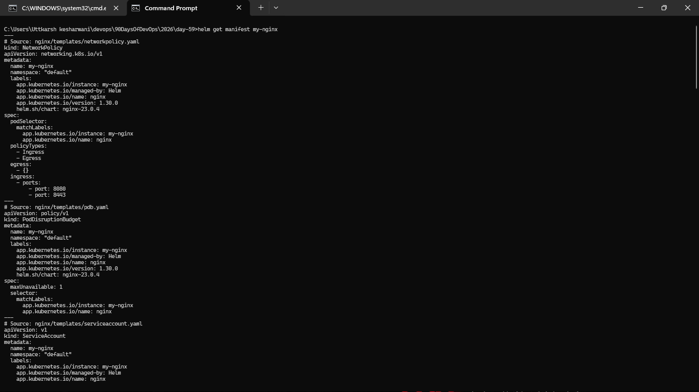
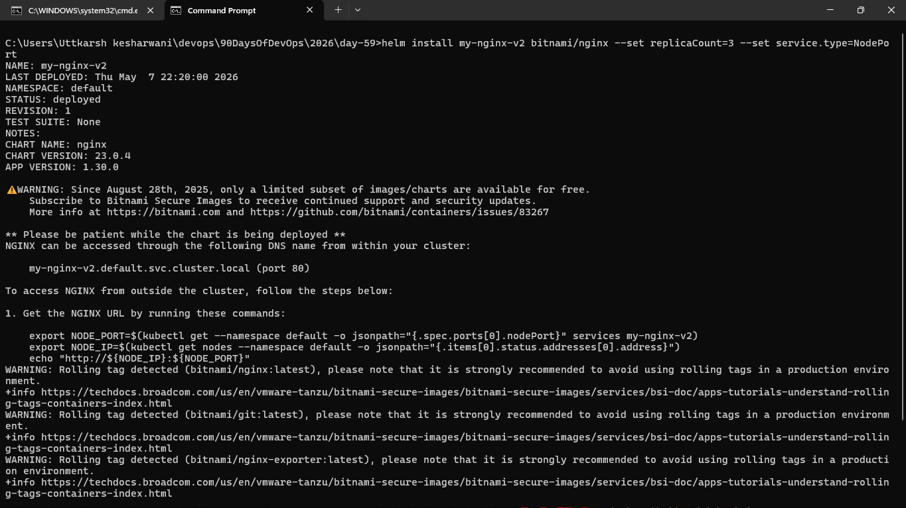
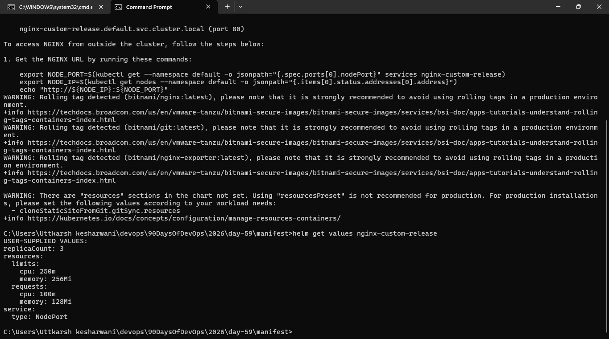
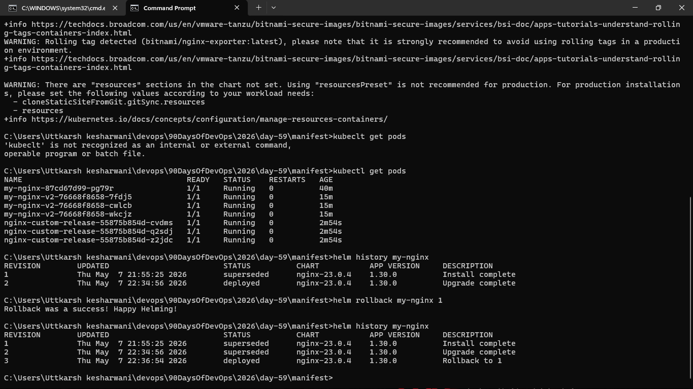
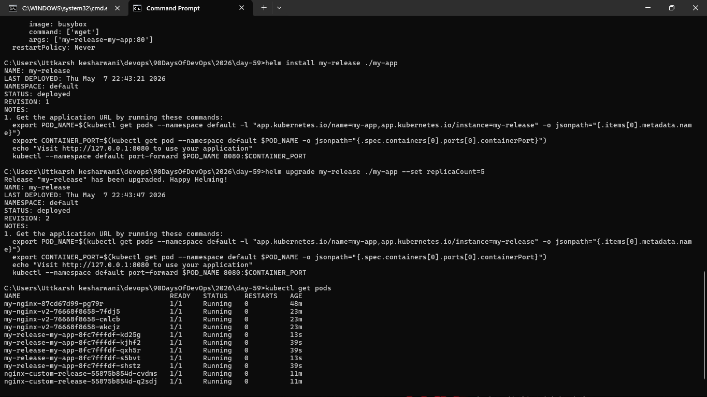
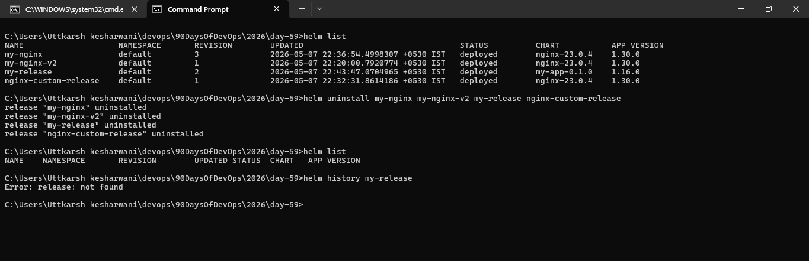

### Task 1: Install Helm
1. Install Helm (brew, curl script, or chocolatey depending on your OS)
2. Verify with `helm version` and `helm env`

### Task 2: Add a Repository and Search
1. Add the Bitnami repository: `helm repo add bitnami https://charts.bitnami.com/bitnami`
2. Update: `helm repo update`
3. Search: `helm search repo nginx` and `helm search repo bitnami`

### Task 3: Install a Chart
1. Deploy nginx: `helm install my-nginx bitnami/nginx`
2. Check what was created: `kubectl get all`
3. Inspect the release: `helm list`, `helm status my-nginx`, `helm get manifest my-nginx`

### Task 4: Customize with Values
1. View defaults: `helm show values bitnami/nginx`
2. Install a custom release with `--set replicaCount=3 --set service.type=NodePort`
3. Create a `custom-values.yaml` file with replicaCount, service type, and resource limits
4. Install another release using `-f custom-values.yaml`
5. Check overrides: `helm get values <release-name>`

### Task 5: Upgrade and Rollback
1. Upgrade: `helm upgrade my-nginx bitnami/nginx --set replicaCount=5`
2. Check history: `helm history my-nginx`
3. Rollback: `helm rollback my-nginx 1`
4. Check history again — rollback creates a new revision (3), not overwriting revision 2

Same concept as Deployment rollouts from Day 52, but at the full stack level.

### Task 6: Create Your Own Chart
1. Scaffold: `helm create my-app`
2. Explore the directory: `Chart.yaml`, `values.yaml`, `templates/deployment.yaml`
3. Look at the Go template syntax in templates: `{{ .Values.replicaCount }}`, `{{ .Chart.Name }}`
4. Edit `values.yaml` — set replicaCount to 3 and image to nginx:1.25
5. Validate: `helm lint my-app`
6. Preview: `helm template my-release ./my-app`
7. Install: `helm install my-release ./my-app`
8. Upgrade: `helm upgrade my-release ./my-app --set replicaCount=5`

**Verify:** After installing, 3 replicas? After upgrading, 5?

### Task 7: Clean Up
1. Uninstall all releases: `helm uninstall <name>` for each
2. Remove chart directory and values file
3. Use `--keep-history` if you want to retain release history for auditing

