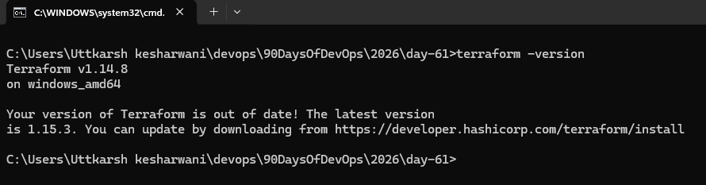
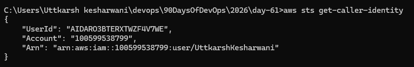
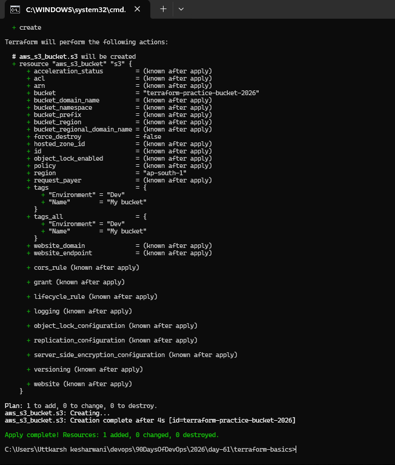
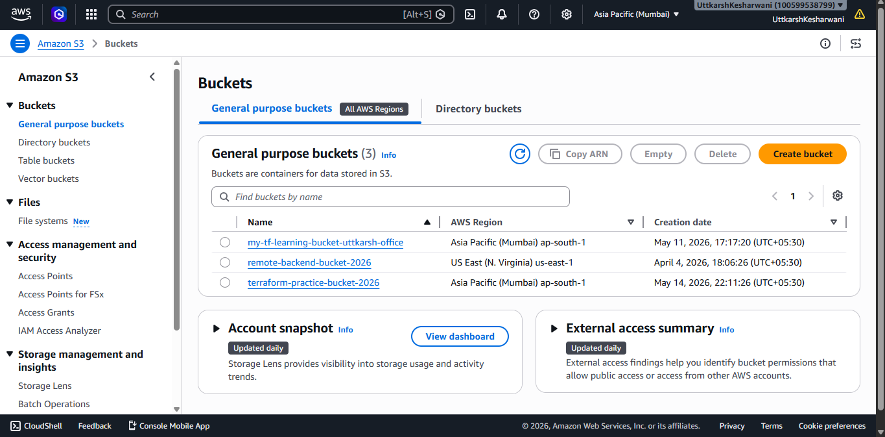
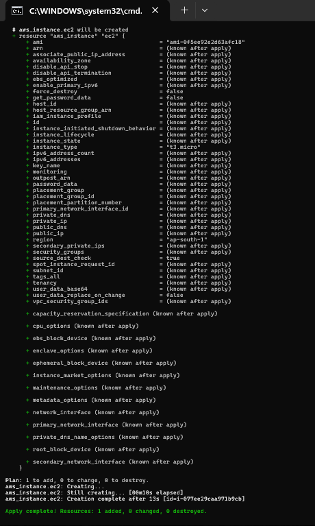
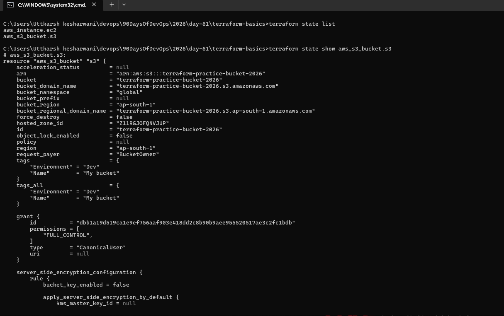
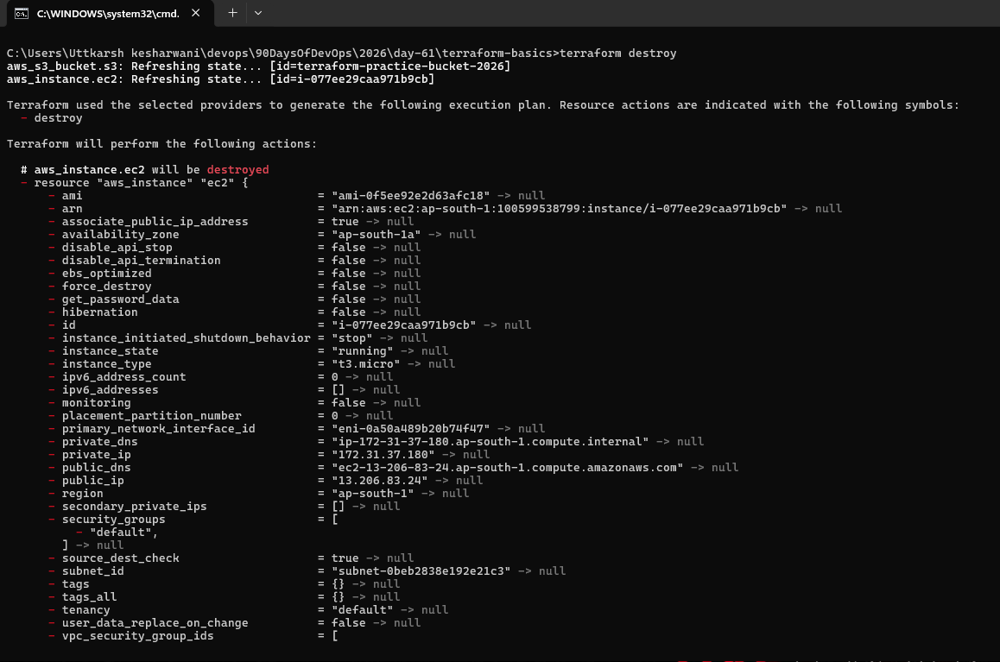

### Task 1: Understand Infrastructure as Code
Before touching the terminal, research and write short notes on:

1. What is Infrastructure as Code (IaC)? Why does it matter in DevOps?
- Writing the code to create the infrastructure is something know as  Infrastructure as Code (IaC) , it matters because it is very tedious task and error prone task to create all the resources manually 

2. What problems does IaC solve compared to manually creating resources in the AWS console?
- It is less error prone , no manual intervention .


3. How is Terraform different from AWS CloudFormation, Ansible, and Pulumi?
- the work of terraform/CloudFormation is to create the resources/infra , while ansible is used to configure the server 

4. What does it mean that Terraform is "declarative" and "cloud-agnostic"?
- We declare the configration that what we need and tf perform the action underneath , Cloud-agnostic means, Terraform can work with MANY cloud providers, not only AWS.


### Task 2: Install Terraform and Configure AWS



3. Install and configure the AWS CLI:
- done

4. Verify AWS access:



### Task 3: Your First Terraform Config -- Create an S3 Bucket





### Task 4: Add an EC2 Instance



**Document:** How does Terraform know the S3 bucket already exists and only the EC2 instance needs to be created?
- Terraform has terraform.tfstate file and whenever we run the command terraform intially match the present infra with tf.state file .


### Task 5: Understand the State File
1. Open `terraform.tfstate` in your editor -- read the JSON structure
2. Run these commands and document what each returns:
```bash
terraform show                          # Human-readable view of current state
terraform state list                    # List all resources Terraform manages
terraform state show aws_s3_bucket.<name>   # Detailed view of a specific resource
terraform state show aws_instance.<name>
```




### Task 6: Modify, Plan, and Destroy
