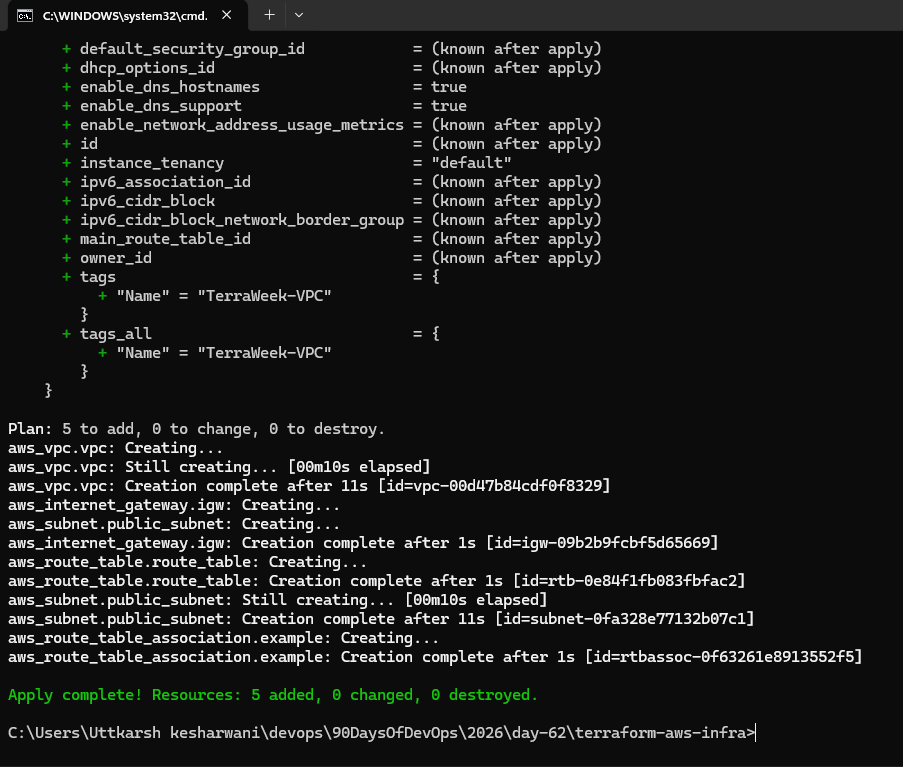
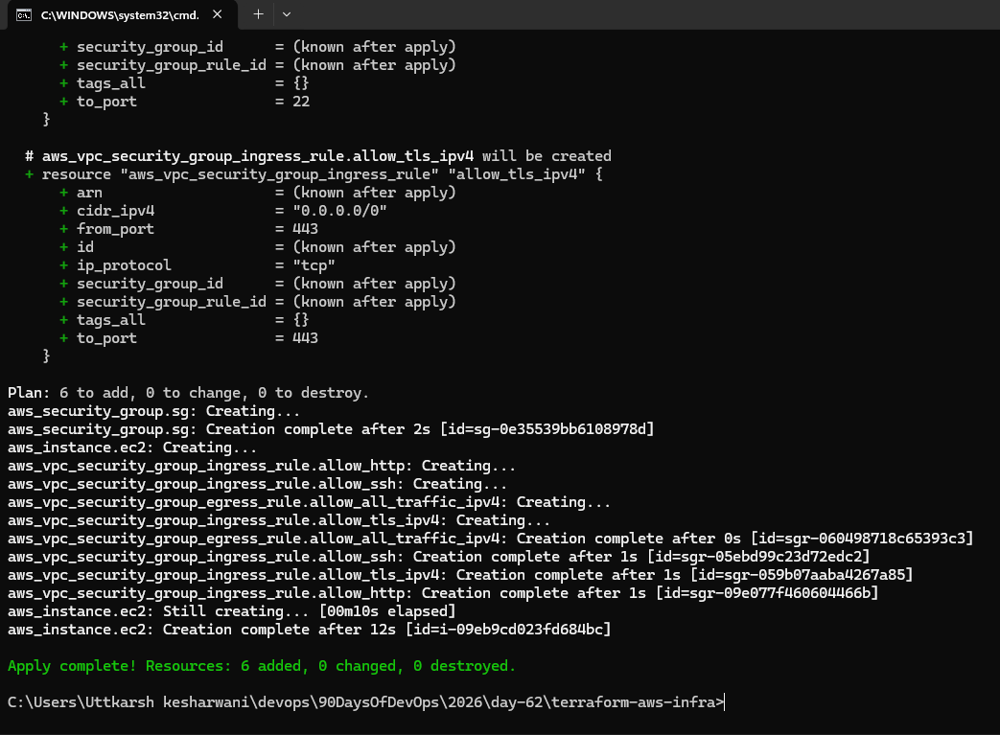
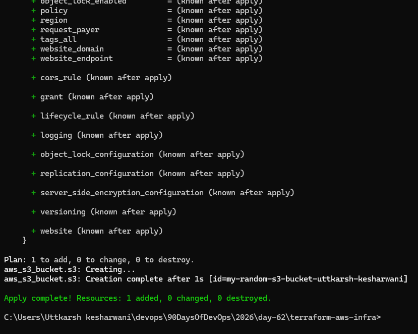
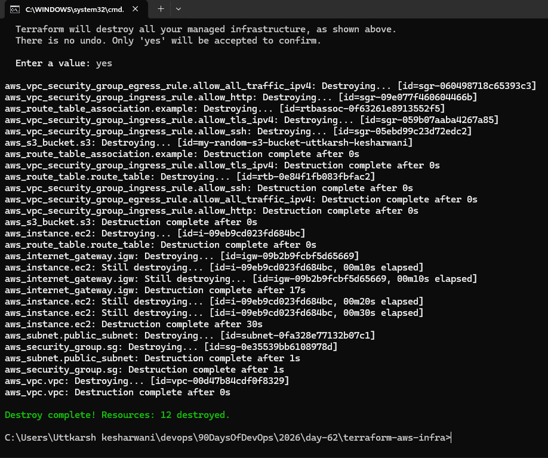

### Task 1: Explore the AWS Provider
1. Create a new project directory: `terraform-aws-infra`
2. Write a `providers.tf` file:
   - Define the `terraform` block with `required_providers` pinning the AWS provider to version `~> 5.0`
   - Define the `provider "aws"` block with your region
3. Run `terraform init` and check the output -- what version was installed?
4. Read the provider lock file `.terraform.lock.hcl` -- what does it do?

**Document:** What does `~> 5.0` mean? How is it different from `>= 5.0` and `= 5.0.0`?

### Task 2: Build a VPC from Scratch
Create a `main.tf` and define these resources one by one:

1. `aws_vpc` -- CIDR block `10.0.0.0/16`, tag it `"TerraWeek-VPC"`
2. `aws_subnet` -- CIDR block `10.0.1.0/24`, reference the VPC ID from step 1, enable public IP on launch, tag it `"TerraWeek-Public-Subnet"`
3. `aws_internet_gateway` -- attach it to the VPC
4. `aws_route_table` -- create it in the VPC, add a route for `0.0.0.0/0` pointing to the internet gateway
5. `aws_route_table_association` -- associate the route table with the subnet

Run `terraform plan` -- you should see 5 resources to create.

**Verify:** Apply and check the AWS VPC console. Can you see all five resources connected?

### Task 3: Understand Implicit Dependencies
Look at your `main.tf` carefully:

1. The subnet references `aws_vpc.main.id` -- this is an implicit dependency
2. The internet gateway references the VPC ID -- another implicit dependency
3. The route table association references both the route table and the subnet

Answer these questions:
- How does Terraform know to create the VPC before the subnet?
-> Because terraform build the dependency graph before making any resource and try to build the resource as per dependency.

- What would happen if you tried to create the subnet before the VPC existed?
-> The VPC must exist before making the subnet , so aws api will through error

- Find all implicit dependencies in your config and list them
* Subnet Depends on VPC
* Internet Gateway Depends on VPC 
* Route Table Depends on VPC
* Route Inside Route Table Depends on Internet Gateway
* Route Table Association Depends on Subnet

### Task 4: Add a Security Group and EC2 Instance
Add to your config:

1. `aws_security_group` in the VPC:
   - Ingress rule: allow SSH (port 22) from `0.0.0.0/0`
   - Ingress rule: allow HTTP (port 80) from `0.0.0.0/0`
   - Egress rule: allow all outbound traffic
   - Tag: `"TerraWeek-SG"`

2. `aws_instance` in the subnet:
   - Use Amazon Linux 2 AMI for your region
   - Instance type: `t2.micro`
   - Associate the security group
   - Set `associate_public_ip_address = true`
   - Tag: `"TerraWeek-Server"`

Apply and verify -- your EC2 instance should have a public IP and be reachable.

### Task 5: Explicit Dependencies with depends_on
Sometimes Terraform cannot detect a dependency automatically.

1. Add a second `aws_s3_bucket` resource for application logs
2. Add `depends_on = [aws_instance.main]` to the S3 bucket -- even though there is no direct reference, you want the bucket created only after the instance
3. Run `terraform plan` and observe the order

### Task 6: Lifecycle Rules and Destroy

