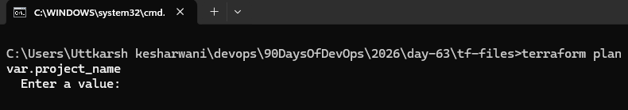
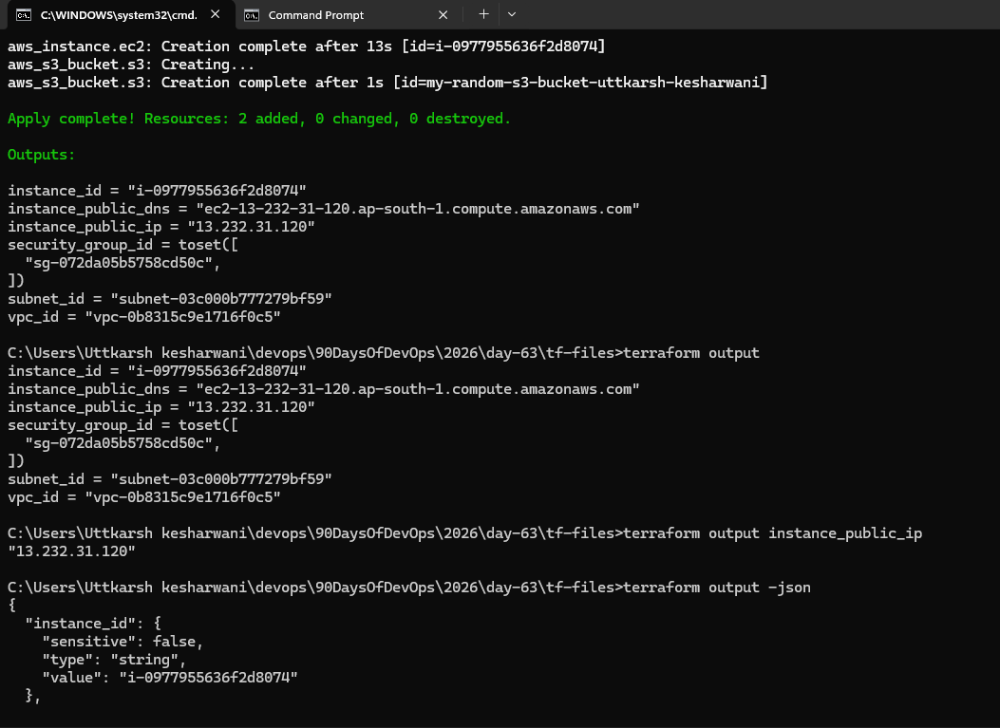
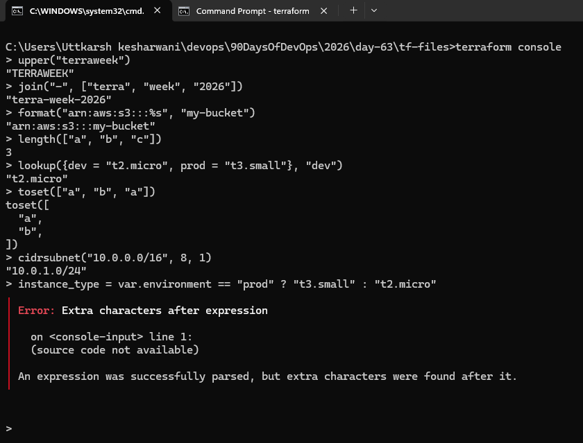

### Task 1: Extract Variables
Take your Day 62 infrastructure config and refactor it:

1. Create a `variables.tf` file with input variables for:
   - `region` (string, default: your preferred region)
   - `vpc_cidr` (string, default: `"10.0.0.0/16"`)
   - `subnet_cidr` (string, default: `"10.0.1.0/24"`)
   - `instance_type` (string, default: `"t2.micro"`)
   - `project_name` (string, no default -- force the user to provide it)
   - `environment` (string, default: `"dev"`)
   - `allowed_ports` (list of numbers, default: `[22, 80, 443]`)
   - `extra_tags` (map of strings, default: `{}`)

2. Replace every hardcoded value in `main.tf` with `var.<name>` references
3. Run `terraform plan` -- it should prompt you for `project_name` since it has no default

### Task 2: Variable Files and Precedence

LOWEST → HIGHEST Priority

Correct precedence order:

1. default value
2. TF_VAR_* environment variable
3. terraform.tfvars
4. *.auto.tfvars
5. -var-file
6. -var

Higher one overrides lower one.

### Task 3: Add Outputs
Create an `outputs.tf` file with outputs for:

1. `vpc_id` -- the VPC ID
2. `subnet_id` -- the public subnet ID
3. `instance_id` -- the EC2 instance ID
4. `instance_public_ip` -- the public IP of the EC2 instance
5. `instance_public_dns` -- the public DNS name
6. `security_group_id` -- the security group ID

### Task 4: Use Data Sources
Stop hardcoding the AMI ID. Use a data source to fetch it dynamically.

1. Add a `data "aws_ami"` block that:
   - Filters for Amazon Linux 2 images
   - Filters for `hvm` virtualization and `gp2` root device
   - Uses `owners = ["amazon"]`
   - Sets `most_recent = true`
2. Replace the hardcoded AMI in your `aws_instance` with `data.aws_ami.amazon_linux.id`
3. Add a `data "aws_availability_zones"` block to fetch available AZs in your region
4. Use the first AZ in your subnet: `data.aws_availability_zones.available.names[0]`

**Document:** What is the difference between a `resource` and a `data` source?
- resource is something that need to create from scratch and data is something that is used to fetch the detail about the already existing/created resources

### Task 5: Use Locals for Dynamic Values

### Task 6: Built-in Functions and Conditional Expressions
Practice these in `terraform console`:

