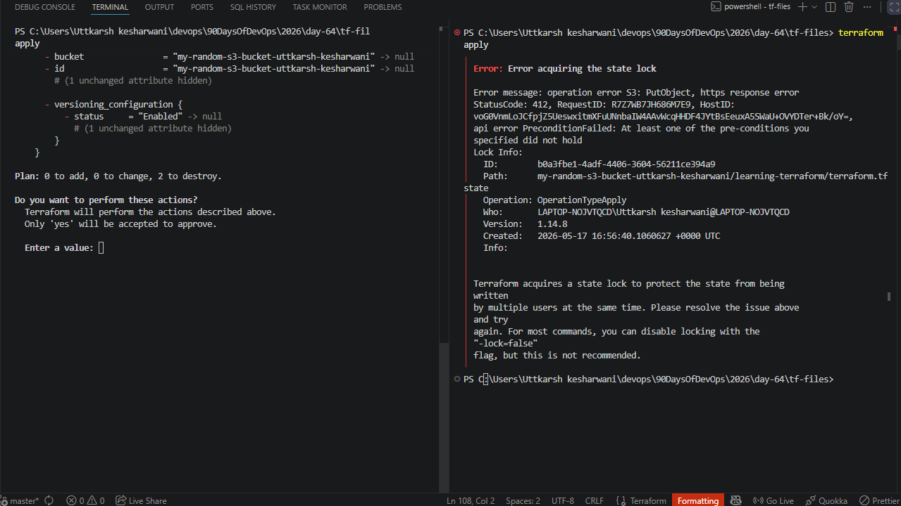
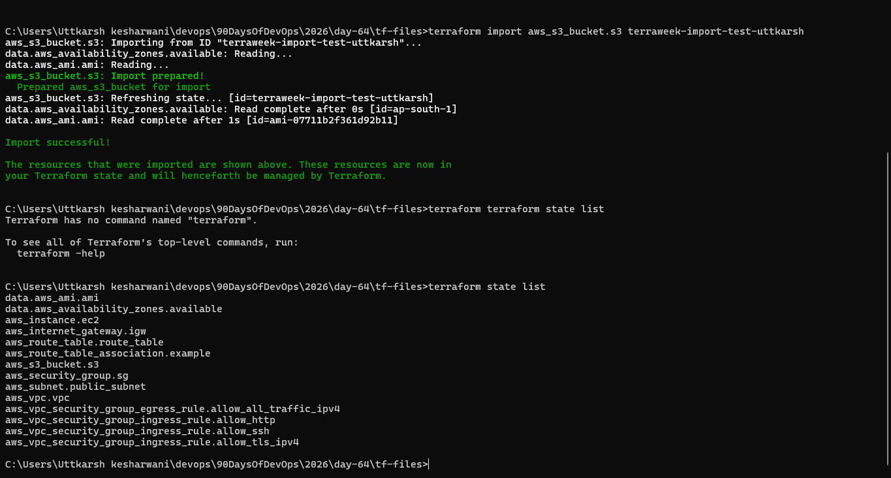
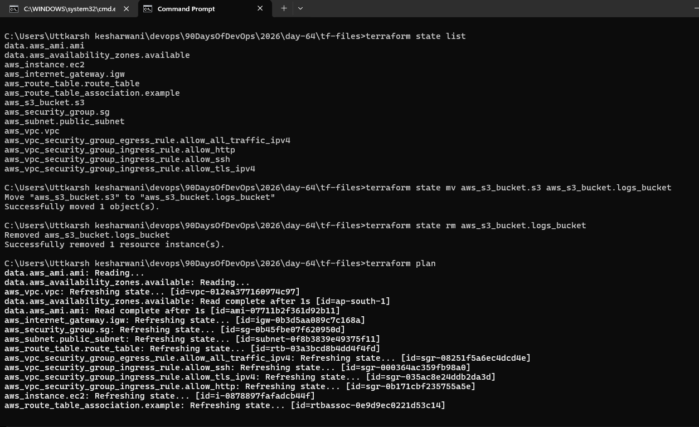
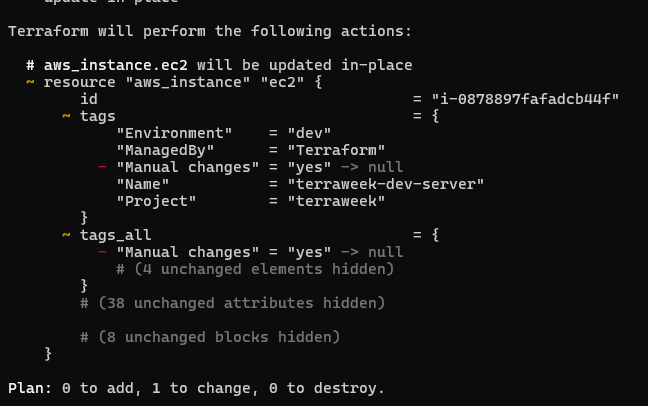

### Task 1: Inspect Your Current State

Answer:
1. How many resources does Terraform track?
- All resources managed by terraform 

2. What attributes does the state store for an EC2 instance? (hint: way more than what you defined)
- It shows all the resource argument that it takes mention in terrafrom docs

3. Open `terraform.tfstate` in an editor -- find the `serial` number. What does it represent?
- At each operation of terraform ,it increase the serial no by 1 to track the changes

### Task 2: Set Up S3 Remote Backend
Storing state locally is dangerous -- one deleted file and you lose everything. Time to move it to S3.

1. First, create the backend infrastructure (do this manually or in a separate Terraform config):

### Task 3: Test State Locking
State locking prevents two people from running `terraform apply` at the same time and corrupting the state.

### Task 4: Import an Existing Resource
Not everything starts with Terraform. Sometimes resources already exist in AWS and you need to bring them under Terraform management.

**Document:** What is the difference between `terraform import` and creating a resource from scratch?

- if the resource is already being created on the cloud and you want that is should now be tracked by the terraform then at that case u will use the import , and when creating a resource from scratch it will be tracked by tf.

### Task 5: State Surgery -- mv and rm
Sometimes you need to rename a resource or remove it from state without destroying it in AWS.

### Task 6: Simulate and Fix State Drift
State drift happens when someone changes infrastructure outside of Terraform -- through the AWS console, CLI, or another tool.

